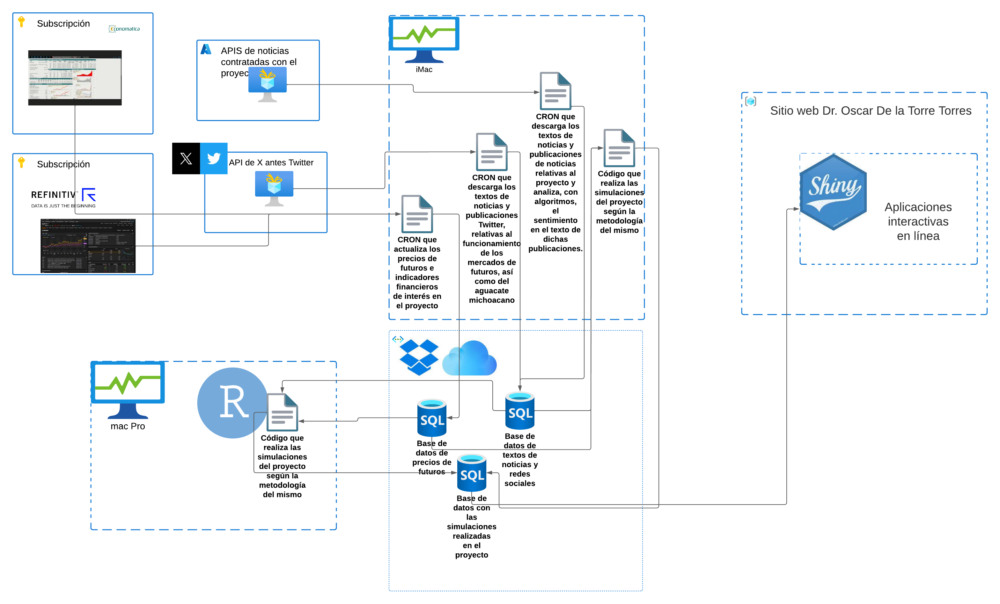

```{r setup, include=FALSE}
knitr::opts_chunk$set(echo = TRUE)
options(tinytex.verbose = TRUE)
library(flextable)
library(openxlsx)
library(plotly)
library(tibble)
library(dplyr)
library(bookdown)
library(tidyr)
library(plan)
library(forcats)
```

\begin{center}
\textbf{19 páginas efectivas de lectura en el documento sin incluir la presente portada. 18 de estas sin incluir la tabla de contenido}
\end{center}

```{r logo1, echo=FALSE, out.width="20%", fig.align = 'center'}
knitr::include_graphics("picir.png")
```

```{r logo3, echo=FALSE, out.width="20%", fig.align = 'center'}
knitr::include_graphics("umsnh100a.jpg")
```

\newpage 

\setcounter{tocdepth}{6}
\tableofcontents

\newpage 

# Datos generales del proyecto

**Folio ICTI:** ICTI-PICIR23-086

**Estado:** APROBADO Y EN PROCESO DE EJECUCIÓN

**Aprobación ICTI:** [Liga de la aprobación](https://icti.michoacan.gob.mx/picir-2023/)

**Informe final del proyecto 2024**: [Liga del informe final en el año 2024](https://oscarvdelatorretorres.github.io/proyectosInvestigacion/icti2023/informe2024.html)

# Resumen ejecutivo

 En el presente proyecto de investigación se propone el desarrollo de una cobertura sintética para cubrir el precio de compra (venta) del precio nacional del aguacate Hass producido en el Estado de Michoacán. Para desarrollar dicha cobertura sintética se propone replicar el esquema de precios de garantía de SEGALMEX en las que este organismo del Gobierno Federal adquiere coberturas del maíz, trigo y arroz en las bolsas de derivados de Chicago y Nueva York. Esto a fin de ofrecer una cobertura (precios de garantía) de dichas mercancías a los productores mexicanos. Partiendo de esta necesidad práctica (cobertura dle precio del aguacate), se propone en este proyecto de investigación el desarrollo y prueba de un algoritmo que permita diseñar y seleccionar un portafolio óptimo de opciones de los principales futuros agrícolas de las bolsas de derivados de Chicago y Nueva York. 
 **El objetivo fundamental del presente proyecto es demostrar la viabilidad material y factibilidad de las coberturas sintéticas que podría diseñar SEGALMEX para ofrecer un precio de garantía del precio nacional del aguacate Hass producido en Michoacán**.
 Como parte de los retos científicos a resolver en este proyecto, se tiene que demostrar que la cobertura sintética es una replica lo suficientemente aproximada del precio del aguacate Hass. Sobre todo, se debe demostrar que la productividad de la industria del de aguacate Hass producido en Michoacán se incrementa si adquiere (con SEGALMEX o algún organismo afín) la cobertura sintética del precio de venta (compra) del aguacate.
 El presente proyecto se espera impacte en el desarrollo económico del Estado de Michoacán. En concreto, en el índice de ingreso y la generación de productividad en la Entidad. Esto al mejorar el perfil de ingresos de productores y comercializadores de aguacate, así como una adecuada formación de precios y de mercado. De manera complementaria, se busca contribuir a las metas y **objetivos de seguridad y soberanía alimentaria2** establecidos en el **Plan Nacional de Desarollo 2018-2024** de la República Mexicana, así como con los objetivos de prosperidad económica de **Promover el crecimiento con bienestar y progreso con justicia** y **Fortalecer la gestión de riesgos financieros** y del **PLADIEM** del estado de Michoacán de Ocampo.
 Con los resultados de este proyecto se espera que se fortalezcan la soberanía y seguridad alimentarias. Esto al tener mejores esquemas de cobertura del precio del aguacate producido en la Entidad y al lograr que los productores y comercializadores generen mayores ingresos, lo cual redunda en mayor empleo y bienestar en la industria del aguacate.

# Descripción de la propuesta

## Introducción a la propuesta

El presente proyecto de investigación busca demostrar que es factible que un organismo público, como Seguridad Alimentaria Mexicana (SEGALMEX), pueda diseñar y adquirir una cobertura sintética del aguacate Hass producido en Michoacán. Esto a efecto de ofrecer ubsidios a precios de garantía de este fruto. Tal como lo viene haciendo en los precios del maíz, trigo y arroz, a fin de lograr una mayor seguridad y soberanía alimentarias.

Dado que no existe cobertura alguna de esta fruta, se busca demostrar que el algoritmo utilizado (y probado) para diseñar la cobertura sintética óptima, puede generar una mayor productividad en la industria del aguacate en el Estado de Michoacán. Dicha cobertura sintética, al igual que lo hace SEGALMEX con el maíz, trigo y arroz, consistirá en un portafolio de opciones de compra o venta de algunas mercancías agrícolas de las bolsas de derivados de Chicago (CBOT) y Nueva York (NYMEX): arroz, avena, azúcar, café, cacao, maíz trigo o grano de soya.

Esta cobertura se diseñará con un algoritmo escrito para seleccionar óptimamente un portafolio de opciones, considerando dos escenarios:

1. Un escenario con los datos históricos del precio nacional del aguacate Hass michoacano comercializado en las principales centrales de abastos^[Precios extraídos diariamente de las bases de datos del Sistema Nacional de Información de mercados o SNIIM en lo sucesivo], así como históricos de los precios de los futuros y opciones de las mercancías agrícolas previamente citadas, mismas que cotizan en las dos bolsas de derivados de Chicago y Nueva York.
2. El escenario anterior, incorporando el efecto que información económica y conductista tiene sobre el comportamiento de los precios estudiados. En específico, el sentimiento que se puede extraer del texto de noticias en Internet y redes sociales. El fin de este escenario es incorporar dicho sentimiento en el comportamiento de los precios, el diseño de la cobertura sintética (portafolio de opciones) y en el proceso de toma de decisiones de cobertura.

## Objetivos y acciones, conforme al PLADIEM y la convocatoria, que el presente proyecto busca lograr{#objetivosPLADIEM}

Dentro de las pruebas o simulaciones a realizar, se probará si el uso de estas coberturas sintéticas del precio del aguacate teóricamente ofrecidas por SEGALMEX permiten ingresos más estables para los productores y comercializadores de aguacate en Michoacán. Esto llevará, como consecuencia, que se tenga una mayor entrada de ingresos en esta industria y se cumplan con dos de sus objetivos de prosperidad económica del Gobierno del Estado de Michoacán de Ocampo en su Plan de Desarrollo Integral de Michoacán (PLADIEM):

1. **Promover el crecimiento con bienestar y progreso con justicia**: Esto se logrará al poder desarrollar un algoritmo y procedimientos que permitan cubrir el precio del aguacate Hass producido en la Entidad. Actualmente el Gobierno Federal, por medio de SEGALMEX ofrece incentivos para precios de garantía en maíz, trigo y arroz. Esto al cubrir el riesgo de fluctuación de precios de estas mercancías al adquirir coberturas en la bolsa de derivados de Chicago. Al no existir un futuro del precio del aguacate, entidades como SEGALMEX no pueden ofrecer precios de garantía de otras frutas u hortalizas (como el aguacate Hass) por lo que el presente proyecto de investigación busca explorar la posibilidad de utilizar un algoritmo de diseño de una cobertura sintética. Esta cobertura se logrará con el diseño de un portafolio óptimo de opciones que permita replicar, lo más aproximado posible, el precio del aguacate Hass michoacano. Situación que permitiría ofrecer precios de garantía a los productores y comercializadores de aguacate.
2. **Fortalecer la gestión de riesgos financieros y disminuir la deuda pública por habitante**: Esto se logrará al permitir un esquema de garantía de precios de compra o venta del aguacate Hass, lo que incentivaría a una mejor base de ingresos y una mayor fiscalización de los productores y comercializadores de aguacate Hass. Al tener estos ingresos más estables, su nivel de ingreso mejoraría. Esto permitirá una mayor prosperidad y bienestar en las regiones donde laboran. **Para citar un ejemplo de cómo una mayor productividad del aguacate generaría mejores niveles de bienestar e incluso seguridad^[Implementar políticas públicas que promuevan la reconciliación y la justicia, especialmente en comunidades afectadas por la violencia y el conflicto [@Michoacan2021]], se tiene el trabajo de Yoo [-@Yoo2022]. Este autor demuestra que por cada 100 toneladas de aguacate producidas, la tasa de homicidios se reduce en 0.65 \% en las zonas productoras de aguacate**. De manera complementaria a lo anterior, este autor estimó que **la industria del aguacate en Michoacán genera 310,000 empleos directos y 78,000 indirectos**.

De manera complementaria, el presente proyecto busca complementar y abonar a los esfuerzos del Consejo Nacional de Ciencia y Tecnología (CONACyT), a efectos de con las pruebas realizadas en este proyecto, poder probar que las coberturas sintéticas del precio del aguacate contribuyan al logro de la soberanía y seguridad alimentaria. Logro que forma parte dentro de las metas de lograr **una soberanía alimentaria** está claramente planteado en los Programas Nacionales Estratégicos CONACyT (**PRONACES**).

Finalmente, en relación a los objetivos y acciones del PLADIEM en materia de Ciencia, Tecnología e Innovación, el presente proyecto busca contribuir a la **acción 2.2.4.8 "Fomentar el desarrollo científico y tecnológico, a través de la innovación y la investigación aplicada"**, del eje 2. Así como a las acciones **3.2 "“Impulsar la competitividad del Estado y la integración de los territorios con infraestructura, equipamiento, tecnologías digitales e iniciativas estratégicas, incluyentes, sostenibles, eficientes, accesibles y seguros, basadas en una visión de desarrollo regional"** y **3.5.1.2 "Impulsar la investigación e innovación aplicada a sectores productivos mediante la cooperación interinstitucional."**

## Tipo de propuesta de proyecto de investigación conforme a concovatoria

Se pretende que el presente proyecto sea una propuesta del tipo de las **propuestas de proyectos de investigación científica con impacto regional (demanda libre)**.

## Beneficiarios del proyecto de investigación

Los beneficiarios de este proyecto de investigación serán los productores y comercializadores de aguacate del estado de Michoacán quienes, potencialmente, podrían contar con mecanismos de coberturas o precios de garantía sobre el aguacate que producen. Esto con la finalidad de reducir volatilidad en sus ingresos.

De manera complementaria, el Gobierno del Estado de Michoacán se podría ver beneficiado en materia de ingresos por dos canales:

1. A mayores beneficios de los productores y comercializadores de aguacate en Michoacán, mayor será la base tributaria que el Gobierno Estatal y Federal pueden tener. Esto impactará en una **adecuada adminsitración de riesgos financieros y reducción de la deuda de Michoacán** (objetivo expresado en el PLADIEM).
2. Como resultado del deseo de participar en este programa de coberturas, el Gobierno Federal y el Gobierno Estatal podrán tener mayor evidencia documental de las ventas de aguacate que productores y empacadores podrán tener, al ser ingresos declarados aquellos que se están cubriendo con estas coberturas sintéticas.

De una manera indirecta, **la población vulnerable en condiciones de pobreza y aquella población vulnerable por incidencias del crimen organizado pueden beneficiarse ya que una mayor producción de aguacate, así como una mayor estabilidad en el ingreso, permitirá impactar positivamente en el pilar de ingresos del índice de desarrollo humano o IDH [@PNUD1991] y, conforme lo ha demostrado Yoo [-@Yoo2022], a mayor producción (y mayor estabilidad en los ingresos) de aguacate, menor incidencia de homicidios y violencia (-0.65 \% menos homicidios por cada 100 toneladas de aguacate producidas).**

## Área de conocimiento conforme a convocatoria

El presente proyecto de investigación forma parte de la **Área IV de Ciencias Sociales** prioritaramente, dada la naturaleza del objeto de estudio y usuarios finales. Esto al ser un estudio que busca cubrir el precio del aguacate Hass Michoacano, a efecto de mejorar el perfil de ingresos de los productores y comercializadores.

# Antecedentes de la propuesta

El aguacate Hass es uno de los principales productos agrícolas en México y la principal fuente de ingresos en materia agrícola en el Estado de Michoacán de ocampo. Según estimaciones de Ortiz et. al [-@Paniagua2018] la producción de aguacate contribuye a 10\% del Producto Interno Bruto (PIB) de la entidad y al 4\% del PIB nacional. De manera complementaria, representa el 45\% de la producción agrícola y es considerado una de las principales fuentes de ingreso tanto en el la industria primaria como en la Entidad.

Dada la importancia económica, la producción de este fruto ha desencadenado beneficios e impactos negativos. En el caso de los beneficios, se observa una mejora importante en el nivel de índice de ingresos, al medir el desarrollo económico con el índice de desarrollo humano [@PNUD1991]. Algunas asignaturas de desarrollo como una mejora del desarrollo en los pilares de salud, pobreza y educación, en los municipios productores de aguacate^[Definidos estos como aquellos municipios que producen y/o exportan aguacate Hass por medio de personas físicas y morales afiliadas a la Asociación de Productores y Empacadores de Aguacate de Michoacán (APEAM).].

El aguacate producido en el Estado de Michoacán de Ocampo es una fuente importante de ingresos y desarrollo y, en el lado de los impactos negativos, su desarrollo como industria ha tenido consecuencias ambientales y sociales. En las primeras se ha reducido la cantidad de bosques al presentarse cambios en el uso de tierras para el cultivo de aguacate. Parte de este incremento ha sido en hectáreas que no están registradas ante la APEAM, lo que ha degenerado en una sobre producción y explotación de zonas boscosas y una sobre explotación de los recursos hídricos en la Entidad [@Arima2022].

Si bien la producción de aguacate ha sido base de debates académicos en relación a sus impactos positivos y negativos, el presente trabajo de investigación busca plantear un mecanismo de cobertura del precio del aguacate, con la finalidad de favorecer y hacer más sostenible los ingresos tanto de los productores como del propio Gobierno estatal o Federal que podría ofrecer la cobertura del precio. 

Como es de amplio conocimiento, una de las prioridades tanto del Gobierno Federal como Estatal es lograr una soberanía y seguridad alimentaria que haga a México menos dependiente de las importaciones de productos agrícolas. Dentro de las principales acciones realizadas para este fin, se constituyó el organismo público descentralizado denominado Seguridad Alimentaria Mexicana (SEGALMEX). Esto con el Decreto de creación publicado el 18 de enero del 2019 en el Diario Oficial de la Federación o DOF [-@DOF2019]. Dentro de sus actividades sustanciales se encuentran las siguientes:

1. Promover la autosuficiencia alimentaria del país.
2. Garantizar el abasto de alimentos básicos a la población, en especial a los sectores más vulnerables.
3. **Establecer mecanismos para regular el mercado de alimentos básicos.**
4. **Promover la productividad agrícola y pecuaria.**
5. Fomentar la participación de los productores y consumidores en el sistema alimentario

El que los productores de aguacate del Estado de Michoacán puedan contar con un mecanismo de cobertura del precio del aguacate permitiría dos ojetivos:

1. Que el nivel de ingresos de los productores de aguacate sea más constante o, al menos, estable, generando menor volatilidad en el nivel de generación de riqueza en sus zonas geográficas, así como una mejora en el índice de ingreso, dentro del índice de desarrollo humano. Esto tendría un impacto en el objetivo o actividad 4 de SEGALMEX previamente citada y en cuestiones de seguridad y violencia como se comentó en el apartado de [Objetivos y acciones, conforme al PLADIEM y la convocatoria, que el presente proyecto busca lograr](#objetivosPLADIEM).
2. Que el Gobierno Estatal, en este caso, el Federal puedan tener un mecanismo de cobertura del precio del aguacate, abonaría al logro de la actividad u objetivo 2: establecer mecanismos para regular el mercado de alimentos básicos.

SEGALMEX puede ofrecer coberturas de precio y cosecha a pequeños y medianos productores de arroz, frijol, leche, maíz y trigo [@DOF2022]. Para lograr esto, el organismo se vale de la adquisición de coberturas del precio internacional de estas mercancías en la Bolsa de Derivados de Chicago (CBOT). En específico adquiere opciones que le permitan trasladar el riesgo del precio pactado al emisor de dichas coberturas, a efecto de que le cubra el diferencial del precio.

Aunque este programa no tuvo un ejercicio amplio durante el año 2023, es de interés que los productores agrícolas mexicanos y michoacanos puedan acceder a coberturas de los productos que cultivan. Esto por los dos objetivos previamente citados. Desafortunadamente no existe un mercado de derivados o coberturas en México que ofrezca la compra/venta de este tipo de coberturas agrícolas. La única bolsa de derivados en México (la bolsa mexicana de derivados o MEXDER) se enfoca a coberturas financieras como son el tipo de cambio, las tasas de interés de valores de deuda, derivados de índices bursátiles o los precios de algunas acciones que cotizan en la Bolsa Mexicana de Valores. 

Para poder ofrecer las coberturas mediante su programa de precios de garantía para los casos del maíz, arroz y trigo, SEGALMEX cubre su riesgo con la adquisición de coberturas en el CBOT. Con esto, el organismo puede ofrecer esta garantía a los productores. 

Actualmente la bolsa de futuros de mercancías  de Chicago (CBOT) es propiedad de un grupo de bolsas propiedad de la bolsa de mercancías de Chicago (*Chicago Mercantile Exchange* o CME). Dentro de las bolsas que posee este conglomerado, también se encuentra la bolsa de mercancías de Nueva York (New York Mercantile Exchange o NYMEX). Esta también negocía futuros y opciones de mercancías agricolas como son el café arábiga, azúcar refinada, cacao (cocoa) y jugo de naranja (por hablar de algunas de las coberturas de mercancías agrícolas comestibles). Estas coberturas pueden ser de interés para los fines que se exponen a continuación.

Dado que el aguacate Hass mexicano no es una mercancía o *commoditty* con amplia negociación y liquidez como son el maíz, el trigo o el arroz, no existe interés ni necesidad en el CBOT o del NYMEX de emitir coberturas (futuros u opciones) relacionadas al aguacate Hass u otra variedades. Para poder solventar esta necesidad se pueden realizar **coberturas sintéticas**. Este tipo de coberturas se logra mediante un portafolio de futuros u opciones cuyo comportamiento en su valor replique el valor o mercancía (en este caso el precio nacional del aguacate procedente de Michoacán). 

Esto se logra con técnicas de administración de valores y pasivos (conocida como *Asset-liability management*) en donde se determina un índice o precio de referencia cuyo comportamiento debe ser replicado con un portafolio de valores [@Scherer2007;@Ziemba2003;@Maginn2007b;@Waring2004b].

## Problema general de investigación 

Dado que SEGALMEX u otro organismo público Estatal o Federal podrían implementar un esquema de precios de cobertura del precio del aguacate producido en el Estado de Michoacán y debido a que no existe un futuro y opción que cubra el precio, así como alguna institución financiera que desee cubrir el riesgo de fluctuaciones en el precio de este producto, se tiene el siguiente problema general de investigación a resolver:

**¿Es posible diseñar y adquirir un portafolio de coberturas (opciones) de las bolsa de mercancías de Chicago (CBOT) y de Nueva York (NYMEX) para cubrir el precio de compra o venta del aguacate Hass producido en el Estado de Michoacán?**

## Problemas particulares de investigación{#problemasParticulares}

El resolver este problema conlleva dos problemas particulares a resolver:

1. Resolver el problema **¿Tiene el comportamiento del precio de los futuros agrícolas maíz, trigo, arroz, soya, café, azúcar, jugo de naranja, cocoa) una relación estadística con el precio nacional del aguacate producido en Michoacán?**

2. Resolver **¿Si se adquiere un portfolio de opciones de compra (venta) del arroz, avena, azúcar, café, cacao, maíz trigo o grano de soya se puede cubrir exitosamente el precio de compra (venta) de un productor (comercializador) de aguacate producido en Michoacán?**

El hacer, como se verá en el apartado de [Metodología](#metodologia), se utilizarán y simularán técnicas de selección óptima de portafolios para replicar el comportamiento del precio del aguacate michoacano. El uso de las mismas requiere que se incorpore el efecto que algunas variables financieras y conductistas pueden tener tanto en el precio del aguacate como en los futuros agrícuolas a utilizar en el portafolio que fungirá como la cobertura sintética del anterior. Dentro de las variables financieras entrarán en el análisis algunas métricas de especulación e incertidumbre como son la razón de especulación de Kim [-@Kim2005], el índice de volatilidad implícita de las acciones de los Estados Unidos, el tipo de cambio mexicano (pesos por dólar de los EEUU) y el diferencial de tasas de corto y largo plazo en EEUU y México.

En relación a los factores conductistas, se busca hacer una medición del sentimiento que tanto a nivel de mercado agrícola real como en los mercados agrícolas de Chicago y Nueva York se tiene. Al inicio de los presentes antecedentes se mencionaron algunos impactos positivos y negativos relativos a la producción de aguacate en Michoacán. Esto ha generado algunas controversias y discusiones académicas en medios que han repercutido en la imagen de la producción michoacana de aguacate. 

De manera complementaria, el sentimiento que consimudores y productores tienen en relación a la situación financiera o económica en México y el mundo repercute en el intercambio y en el precio del aguacate comercializado. Dicho esto, se busca incorporar la medición en el sentimiento (negativo o positivo) que las personas pueden tener. Sentimiento que puede repercutir en el precio y comercialización de aguacate, situación que debe incorporarse en el modelo de selección óptima del portafolio de coberturas que busca cubrir el precio del aguacate.

Dicho esto se desconoce si el sentimiento de los agentes económicos mexicanos y de Estados Unidos tiene un impacto en el precio del aguacate y su cobertura. En específico, no se sabe si el sentimiento negativo (o de incertidumbre) en materia económica o financiera (medido por medio del texto de noticias o el texto de publicaciones en redes sociales) tiene un impacto en el precio del aguacate, las coberturas agrícolas y en el portafolio de coberturas utilizado como respaldo para cubrir el precio del aguacate.


Como consecuencia, el tercer, cuarto y quinto problemas particulares de investigación a resolver serían

3. **¿Tiene un impacto el sentimiento negativo medido en noticias o redes sociales en el precio del aguacate producido en Michoacán?**
4. **¿Tiene un impacto el sentimiento negativo medido en noticias o redes sociales en el precio de los futuros del arroz, avena, azúcar, café, cacao, maíz trigo o grano de soya?**
5. **Si se incorpora el sentimiento negativo de noticias o redes sociales en el proceso de selección óptima del portafolio de coberturas para el precio del aguacate ¿Se obtendrán mejores resultados que el portafolio que no incorpora este sentimiento?**

De resolverse el problema general de investigación y los 5 particulares, el Gobierno Federal o Estatal (por medio de SEGALMEX u otro organismo público) estarían en posición de brindar coberturas al precio de un producto agrícola que actualmente no la tiene. Esto al trasladar el riesgo de fluctuación de precios al portafolio de coberturas (opciones) compradas. Como se verá en el apartado de [Entregables comprometidos](#Entregables) y de demostrarse como exitoso el empleo del algoritmo de coberturas desarrollado, se podrá presentar y publicar un breve documento técnico con el mecanismo o procedimiento de coberturas que podría implementar SEGALMEX o algún organismo similar.

Esto se hará en un sitio web interactivo con los resultados actualizados (de manera automática) en el [sitio web del Dr. Oscar De la Torre Torres](https://oscardelatorretorres.com).

# Hipótesis general y específicas de la investigación{#Hipotesis}

En consistencia a los problemas de investigación planteados, ahora se presentan las hipótesis general y particulares de la investigación.

## Hipótesis general{#hipotesisGeneral}

En congruencia al problema general de investigación planteado se establece la siguiente hipótesis general de investigación a demostrar:

**$H_0:$ Se puede cubrir exitosamente el precio nacional de compra (venta) del aguacate Hass producido en el Estado de Michoacán por medio de una cobertura sintética formada con un portafolio de opciones del arroz, avena, azúcar, café, cacao, maíz trigo o grano de soya cotizadas en las bolsas de derivados de Chicago (CBOT) y Nueva York (NYMEX).**

Para demostrar esta hipótesis y como se verá en el apartado de la [Metodología](#Metologia) se simulará el impacto financiero que tendrá en un productor (comercializador) la cobertura del precio de venta (compra) del aguacate Hass michoacano. Para esto se simularán los ingresos acumulables mensuales de un productor (comercializador) teóricos en dos escenarios:

1. El escenario base en el que no existirá cobertura alguna.
2. El escenario experimental en el que se emplea el algoritmo de coberturas del precio del aguacate.

Si el ingreso acumulado en diferentes periodos de tiempo desde el año 2000 (Periodo de apertura de la frontera de los EEUU al aguacate michoacano) es mayor en el segundo escenario, se verificará la hipótesis general de trabajo del presente proyecto de investigación.

## Hipótesis específicas de investigación{#hipotesisEspecificas}

En congruencia a los 5 problemas de investigación planteados en [la sección correspondiente](#problemasParticulares) se tienen las siguientes hipótesis particulares a demostrar:

1. **$H_1:$ El comportamiento del precio nacional del aguacate producido en el Estado de Michoacán tiene una relación de largo plazo (relación cointegrante) con los precios de los futuros agrícolas del maíz, trigo, arroz, soya, café, azúcar, jugo de naranja y cocoa**.
2. **$H_2:$ El comprar una cobertura sintética por medio de un portafolio de opciones de compra (venta) de los precios de los futuros del arroz, avena, azúcar, café, cacao, maíz trigo o grano de soya permite cubrir exitosamente el precio de compra (venta) de un productor (comercializador) de aguacate producido en Michoacán**
3. **$H_3:$ El sentimiento negativo medido en las noticias o publicaciones de redes sociales tiene un impacto estadísticamente significativo en el precio nacional del aguacate producido en Michoacán: a mayor sentimiento negativo, menor es el precio de compra del aguacate.**
4. **$H_4:$ El sentimiento negativo medido en las noticias o publicaciones de redes sociales tiene un impacto estadísticamente significativo en el precio de los futuros del arroz, avena, azúcar, café, cacao, maíz trigo o grano de soya.**
5. **$H_5:$ El incorporar el sentimiento negativo de noticias o redes sociales en el diseño y compra de la cobertura sintética por medio de un portafolio de opciones de compra (venta) de los precios de los futuros del arroz, avena, azúcar, café, cacao, maíz trigo o grano de soya permite cubrir exitosamente el precio de compra (venta) de un productor (comercializador) de aguacate producido en Michoacán**

La primer hipótesis, de cumplirse, demostrará que el precio nacional del aguacate producido en Michoacán tiene una relación de largo plazo con el precio de los ocho futuros agrícolas con los que se busca realizar la cobertura sintética de dicho precio. De cumplirse esta hipótesis, se facilitaría el modelo de selección óptima de portafolios empleando alguna técnica más simple. En caso contrario, de no existir una relación de largo plazo, se pueden modelar relaciones en el corto (1 a 2 meses) para diseñar el portafolio óptimio que fungirá como cobertura sintética del precio del aguacate. Esto empleando redes neuronales bayesianas.

Las hipótesis segunda y quinta son la base del presente trabajo de investigación ya que la segunda busca demostrar que un modelos de selección óptima de un portafolio de opciones en los ocho futuros agrícolas de interés permitiría tener un modelo cuantitativo para diseñar y ofrecer una cobertura sintética del precio del aguacate michoacano. La quinta hipótesis es una extensión de la segunda. Al demostrar dicha hipótesis se demostraría que el incorpora el sentimiento que las personas tienen en relación a la actividad económica y financiera tiene un impacto benéfico para diseñar la cobertura sintética. Dicho esto, permitiría tener un modelo que incorpore el sentimiento y otras cuestiones conductistas de los agentes económicos, mismos que se podrían aproximar por medio del sentimiento negativo encontrado en el texto de medios de comunicación y redes sociales.

Las hipótesis tercera y cuarta son hipótesis particulares de trabajo y de necesidad para saber si existe una relación de largo plazo entre el sentimiento negativo medido en textos de noticias y publicaciones de redes sociales (que es cambiante a lo largo del tiempo), en relación a las condiciones económicas y financieras.


# Objetivo general y específicos de la investigación{#Objetivo}

## Objetivo general del proyecto de investigación{#objetivoGeneral}
En el presente apartado se expondrán los objetivos de investigación. La exposición se hará en la misma línea que el apartado anterior para exponer los objetivos como una consecuencia necesaria de las hipótesis a demostrar. De manera análoga, se presentan estos objetivos para poder materializarlos como metas cuantificables y verificables de los resultados logrados con el presente trabajo de investigación.

El objetivo general del presente trabajo de investigación, en consistencia a la hipótesis general planteada, es:

**Demostrar que se puede cubrir el precio nacional de compra (venta) del aguacate producido en el Estado de Michoacán por medio de una cobertura sintética formada con un portafolio de opciones del arroz, avena, azúcar, café, cacao, maíz trigo o grano de soya cotizadas en las bolsas de derivados de Chicago (CBOT) y Nueva York (NYMEX).**

## Objetivos específicos del proyecto de ivestigación{#objetivosEspecificos}

De manera consecuente, los objetivos particulares son los siguientes:

1. **Demostrar que el precio nacional del aguacate producido en el Estado de Michoacán tiene una relación de largo plazo (relación cointegrante) con los precios de los futuros agrícolas el maíz, trigo, arroz, soya, café, azúcar, jugo de naranja y cocoa**.

2. **Probar que el empleo de una cobertura sintética realizada por medio de un portafolio de opciones de compra (venta) de los precios de los futuros del arroz, avena, azúcar, café, cacao, maíz trigo o grano de soya permite cubrir exitosamente el precio de compra (venta) de un productor (comercializador) de aguacate producido en Michoacán**.

3. **Medir si existe una relación inversa y estadísticamente significativa entre el sentimiento negativo, medido con el texto las noticias o publicaciones de redes sociales, y el precio nacional del aguacate producido en Michoacán**.

4. **Medir si existe una relación inversa y estadísticamente significativa entre el sentimiento negativo, medido con el texto las noticias o publicaciones de redes sociales, y el precio de los futuros del arroz, avena, azúcar, café, cacao, maíz trigo o grano de soya**.

5. **Probar que el empleo del sentimiento negativo, medido con el texto las noticias o publicaciones de redes sociales, en una cobertura sintética realizada por medio de un portafolio de opciones de compra (venta) de los precios de los futuros del arroz, avena, azúcar, café, cacao, maíz trigo o grano de soya permite cubrir exitosamente el precio de compra (venta) de un productor (comercializador) de aguacate producido en Michoacán**.

Estos objetivos a cumplirse se podrán medir por medio de las metas a detallar a continuación.

# Metas del proyecto de investigación{#Metas}

Para materializar los objetivos plasmados en el apartado anterior, se tienen las siguientes metas. La forma de exponerlas sera detallando las mismas y relacionándolas con los objetivos (general o particulares) que buscan cumplir y, por ende, materializar en resultados cuantificables y verificables.

- Meta 1: Demostrar que el empleo del algoritmo para diseñar la cobertura sintética (seleccionar el portafolio óptimo de opciones de futuros agrícolas) permite tener una rentabilidad mayor que el omitir su uso y dejar que los ingresos del productor o comercializador de aguacate dependan de las fluctuaciones del mercado nacional. Con esto, se daría cumplimiento material al objetivo e hipótesis generales, así como a las hipótesis y objetivos particulares 2 y 5.

- Meta 2: Desarrollar una base de datos actualizable de manera diaria que compile la información historica de los ocho futuros agrícolas que se emplearán en la cobertura sintética y que ayudarán a cubrir el precio nacional del aguacate producido en el Estado de Michoacán.

El cumplimiento de esta meta permitirá tener la infraestructura informática necesaria poder simular y actualizar el valor de un productor y comercializador teóricos que puedan cubrir, mensualmente, el precio unitario de su producción de aguacate Hass. 

- Meta 3: Desarrollar una base de datos actualizable que, de las bases de datos del Sistema Nacional de Información de Mercados [@SNIIM2023] de la Secretaría de Economía, extraiga los precios diarios del aguacate Hass originario del Estado de Michoacán, registrado en las principales centrales de abasto del país y calcule el precio promedio diario.

De manera análoga a la meta anterior, la presente meta permitirá la demostración de las hipótesis general y particulares 2 y 5 y coadyuvará al logro del objetivo general y particulares 2 y 5 del presente proyecto de investigación.

Con el precio promedio diario del aguacate producido en Michoacán se tendrá, con esta base de datos y la de la meta anterior, una infraestructura informática para poder lograr los objetivos de este proyecto y dejar la infraestructura necesaria para el desarrollo de proyectos análogos y extensiones del presente.

- Meta 4: Desarrollar códigos de simulación que se ejecuten de manera mensual para determinar la cobertura sintética idónea, empleando los ocho futuros agrícolas de interés y el precio del aguacate promedio calculados con las metas 2 y 3 previas. Los resultados históricos que se logren en la simulación permitirán tener registros de las ganancias que se lograrían en los tres escenarios de interés: 1) el escenario en el que el productor o comercializador no accedan a ningún tipo de cobertura, 2) el escenario en el que se compra la cobertura sintética sin incorporar el efecto del sentimiento negativo leído en noticias y redes sociales, y 3) el escenario en el que la cobertura sintética se diseña incorporando el sentimiento negativo e información de mercado.

- Meta 5: Desarrollar aplicaciones en línea que permitan publicar los resultados actualizados en el sitio web personal del Dr. Oscar De la Torre Torres. Esto para su acceso gratuito por parte de la comunidad científica y profesional interesada en los temas. El lograr esta meta permitiría tener actualizados y públicos los resultados de las simulaciones realizadas en el presente proyecto. Un ejemplo de las aplicaciones y modelos informáticos que se desarrollan de manera diaria se puede consultar en la siguiente [aplicación en línea del sitio web del dr. Oscar De la Torre torres](https://www.oscardelatorretorres.com/markov1-mx)^[Esta aplicación se desarrolló al amparo de otros proyectos de investigación apoyados por la Coordinación de la Investigación Científica de la Universidad Michoacana de San Nicolás de Hidalgo para realizar coberturas de la inversión de una o un inversionista, al pronosticar la probabilidad de estar en un periodo de alta volatilidad en los mercados.]

El cumplimiento de esta meta permitirá tener un código que ejecute, mensualmente, el algoritmo de selección óptima que permita realizar la cobertura sintética del precio nacional del aguacate producido en el Estado de Michoacán y que permita publicar los resultados actualizados.

- Meta 6: Publicar los resultados de las simulaciones realizadas ante la comunidad científica afín a los agronegocios y a la Administración financiera. Esto implica publicación en artículos de revistas científicas, así como participaciones en ponencias de congresos de investigación (incluyendo el congreso regional de investigación del ICTI en 2024).

# Entregables comprometidos{#Entregables}

Como resultado de los objetivos planteados en el presente proyecto de investigación, así como de las metas que de los mismos surgen, se presentan los siguientes entregables:

1. Publicación de al menos un artículo en una revista científica indizada en Scopus o la Web of Science. El compromiso, dados los tiempos de financiamiento del proyecto, es tener en proceso de revisión o, preferentemente aceptado, el artículo. Para lograr esto, es que se planteará el publicar el artículo en alguna revista académica indizada a Scopus o la Web of Science que opere en el esquema de *open access*. Esto permitirá que los tiempos de revisión y editoriales sean más cortos. Ante esto, como se verá en el apartado del [desglose financiero](#Desglose), se contempla el pago de una publicación de un artículo.
2. La publicación y actualización periódica de los resultados de las simulaciones en una aplicación en línea en el sitio web del Dr. Oscar De la Torre Torres. Esto requerirá, como se verá en el [desglose financiero](#Desglose), del financiamiento de algunas instancias de servidores en nube, así como la contratación de servicios de bases de datos financieras y de APIS de noticias y redes sociales que permitan extraer la información financiera y de noticias.
3. El desarrollo y publicación de una función en R y una en Python que permita acceder a los precios históricos de las principales frutas y hortalizas monitoreadas por el SNIIM. Actualmente el SNIIM solo funciona con una interfaz visual en su sitio web. Con este entregable se pretende que exista una función que permita a más investigadoras e investigadores acceder fácilmente a las bases de datos del SNIIM con esta función. El objetivo es publicarla como una función de fuente abierta y acceso gratuito. La misma se publicará en los repositorios de GitHub y de PyPI.
4. El apoyo al desarrollo de 2 tesis de doctorado. Actualmente se tienen en curso 2 tesis de doctorado que buscan relacionar el sentimiento negativo y positivo en las noticias y redes sociales con los precios del maíz y del café. Esto para desarrollar algoritmos de coberturas de estas mercancías con opciones de las bolsas de Chicago y Nueva York. Es decir, desarrollar algoritmos que permitan a SEGALMEX y a los productores o comercializadores de aguacate determinar los momentos de cobertura necesarios. Por los tiempos de duración del proyecto de investigación propuesto, no se logrará la titulación de alguna de estas 2 tesis doctorales, debido a que los 2 sustentantes les falta 1.5 y 3.5 años para terminar su tesis y plan de estudios en el [Doctorado en Administración de la Facultad de Contadudía y Ciencias Administrativas de la UMSNH](https://www.fcca.umich.mx/doctorado/). A pesar de esto, el presente proyecto apoyará a los requerimientos de infraestructura informática para el logro de resultados en estas dos tesis de investigación:

  - **Factores de índices de sentimiento de mercado que inciden en la estimación de precios de referencia del maíz blanco en México y su cobertura con opciones de la Bolsa de derivados de Chicago a través de un algoritmo de toma de decisiones con precios de garantía de SEGALMEX**. Sustentante: M.C. Rodolfo Adrían López Torres (Doctorado en Administración FCCA-UMSNH). Generación 2021-2025.
  - **Factores de índices de sentimiento de mercado que inciden en la estimación de precios del precio nacional del Café y su cobertura con opciones de la Bolsa de derivados de Chicago. Una propuesta de algoritmo de coberturas para SEGALMEX**. Sustentante: M.A. Francisco Xavier Martínez Medina (Doctorado en Administración FCCA-UMSNH). Generación 2023-2027.

5. Ponencias en al menos 2 congresos de investigación. Se plantea que se expongan los resultados logrados en al menos 2 congresos de investigación, siendo uno de ellos el 19º Congreso Estatal de Ciencia, Tecnología e Innovación organizado por el ICTI.

# Metodología{#Metodologia}

## Diseño metodológico del proyecto de investigación

Para demostrar la hipótesis general y particulares, se realizará una simulación de eventos discretos en la que, de manera mensual, se diseñará la cobertura sintética del precio del aguacate con las opciones de mercancías agrícolas de las bolsas de Chicago y Nueva York. Para esto, el proyecto de investigación hará la siguiente secuencia de pruebas:

1. Se calcularán los precios promedio diario del aguacate Hass originario de Michoacán, desde el año 1997 a la fecha de conclusión de proyecto. Se selecciona el año 1997 por que coincide con los años de apertura de la frontera de los Estados Unidos a las exportaciones de aguacate michoacano y coincide con la fundación de la Asociación de Productores y Empacadores de Aguacate de Michoacán (APEAM).
2. Se extraerán, de APIS y bases de datos en internet, noticias históricas relativas al mercado del aguacate michoacano, así como las relativas a los futuros de las mercancías de interés en las bolsas de Chicago y Nueva York (arroz, avena, azúcar, café, cacao, maíz trigo o grano de soya). Con estas noticias se calcularán índices de sentimiento que serán de 3 tipos: optimista (positivo), neutro o pesimista (negativo). Esto se analizará por computadora con algoritmos y técnicas de ciencia de datos.
3. Se harán pruebas de cointegración (relación estadística de largo plazo) entre el precio promedio del aguacate michoacano con los precios de los futuros de mercancías agrícolas de las bolsas de Chicago y Nueva York. De no ser exitosas, se utilizarán redes neuronales bayesianas para medir la relación de corto plazo.
4. Se harán pruebas de cointegración entre el precio promedio del aguacate michoacano, el histórico de variables económicas y los sentimiento de noticias calculado en las pruebas del numeral 2. En caso de no existir cointegración, se utilizarán redes neuronales bayesianas para poder establecer una relación de corto plazo que permita pronosticar el precio del aguacate ante cambios de las variables económicas o de sentimiento calculadas previamente.
5. Se harán pruebas de cointegración entre los precios de los futuros agrícolas de interés para la cobertura sintética con el histórico de variables económicas, de sus respectivos mercados y los índices de sentimiento calculados en las pruebas del numeral 2. De no existir una relación de largo plazo, también se utilizarán redes neuronales bayesianas para establecer la relación entre estas variables económicas y de sentimiento con los rendimientos esperados de estos futuros.
6. Con los pronósticos logrados con los modelos cuantitativos (redes neuronales o modelos de cointegración) de las pruebas del numeral 4, se correrá una simulación de eventos discretos con periodicidad mensual. En cada mes se pronosticará, conforme a la información económica y de sentimiento vigente en el mes $t$, el movimiento del precio del aguacate michoacano. Si es de baja (alza) se simulará la creación de una cobertura sintética del aguacate empleando el método cuantitativo que se describe en la sección [método para diseñar la cobertura sintética del precio del aguacate](#metodoCoberturaSintetica) siguiente. Una vez determinada la baja (alza) se simulará la venta de esta cobertura o precio de garantía para el productor (comercializador). Con esta, el productor (comercializador) cubrirá o tendrá garantía de su precio de venta (compra) para el siguiente mes. Esta cobertura, teóricamente, la ofrecerá SEGALMEX en las simulaciones. Si las pruebas o simulaciones realizadas demuestran que el productor (comercializador) tiene una mayor rentabilidad que si no hubiera adquirido estas coberturas, se habrá cumplido la hipótesis particular 2.
7. Se realizarán las simulaciones previas, con la diferencia de que el diseño de la cobertura sintética incorpora el efecto que variables económicas y de sentimiento de mercado tienen en el método cuantitativo. Básicamente se sustituirán los rendimientos esperados del portafolio de opciones con los estimados en las pruebas cuantitativas del numeral 5. Si con estas simulaciones se logra demostrar que se tiene una mayor rentabilidad al emplear este segundo tipo de cobertura sintética (en comparación a la cobertura anterior o a no hacer cobertura alguna), se cumplirá la hipótesis particular 5.

### Método para diseñar la cobertura sintética del precio del aguacate{#metodoCoberturaSintetica}

El método del diseño de la cobertura sintética óptima consiste en emplar modelos de selección óptima de portafolios en los que se minimiza el *error de seguimiento* o **tracking error** [@Waring2004b; @Ziemba2003; @Maginn2007b]. El error de seguimiento se determina con la diferencia que el rendimiento o variación porcentual de cada futuro agrícola de interés para formar la cobertura agrícula $r_i$ tiene respecto al rendimiento o variación porcentual del precio del aguacate Hass $r_A$:

\begin{equation}
\varepsilon_i=r_i-r_A
(\#eq:eq1)
\end{equation}

Cada diferencia de cada futuro agrícola $\varepsilon_i$ tendrá su pronóstico mensual de rendimiento esperado para el siguiente mes $E(\varepsilon_i)$ y una matriz de varianzas y covarianzas $\Sigma$ de las diferencias de rendimiento de cada futuro agrícola.

El objetivo de la cobertura sintética es determinar en porcentaje o nivel de inversión $\omega_i$ (acomodado en un vector de niveles de inversión$\mathbf{w=[\omega_i]}$) que se debe invertir (comprar) en las opciones de cada futuro agrícola que permitirán reducir al máximo la diferencia entre la variación porcentual o rendimiento del portafolio de la cobertura síntética $r_p$ con el precio del aguacate michoacano $r_A$. Esto se logrará al resolver el siguiente problema de optimización [@Markowitz1956; @Black1972]:


\begin{equation}
\begin{array}{cc}
\text{arg min } & w \Sigma w \\
\text{s.a.} & \omega_i\geq 0 \\
& \sum \omega_i =100 \%
\end{array}
\end{equation}


Al resolver este problema de optimización se determinará el nivel óptimo $\mathbf{w}*$ de inversión en las opciones de cada uno de los futuros agrícolas a utilizar como parte de la cobertura sintética. El objetivo, en términos teóricos para las pruebas a realizar, es lograr que SEGALMEX compre esta cobertura sintética para un volumen importante de productores (comercalizadores) de aguacate para ofrecerles precios de garantía en el precio de compra (venta). Tal como hace para cubrir el precio del maíz, arroz y trigo, al momento de redactar este protocolo de investigación.

## Infraestructura con la que se cuenta actualmente para realizar el proyectos de investigación.

Para lograr las metas planteadas en el apartado de [Metas del proyecto de investigación](#Metas), así como el de [Entregables comprometidos](#Entregables) que llevarán a la consecución de los objetivos del presente proyecto, se cuenta con infraestructura tecnológica suficiente, la cual se ha adquirido con proyectos de investigación previos como son los de Apoyo a nuevo PTC de PRODEP-SEP o los propios proyectos de investigación financiados, desde el año 2016, al sustentante de este proyecto. Esto último por parte de la Coordinación de la Investigación Científica (CIC) de la Universidad Michoacana de San Nicolás de Hidalgo (UMSNH). La infraestructura es la siguiente:

1. Computadora Mac Pro con procesador Intel Xeon de 3.5 GHz y 6 núcleos, 16 GB de memoria RAM, tarjeta gráfica AMD FirePro de 3GB y 120GB de disco duro en estado sólido. Esta computadora es la que se utiliza para hacer la parte más larga y amplia de las simulaciones de este proyecto de investigación y otros que le han antecedido. Los resultados de las simulaciones realizadas con esta computadora se actualizan, de manera diaria, en la siguiente computadora.
2. Computadora iMac con procesador Intel Core de 1.5 GHz y 2 núcleos, 18 GB de memoria RAM, tarjeta gráfica Intel Graphics de 3de 1.5 GB y 120GB de disco duro en estado sólido. Esta computadora es la que actualizará, de manera diaria o mensual (Según sea el caso) los datos de las simulaciones del presente proyecto.
3. Lenguajes de programación R y Python executados tanto en Rstudio como en Jupiter Networks. Esto para programar y ejecutar los CRONES que, de manera automática, actualizan las simulaciones realizadas.
4. Una licencia de Shiny apps para la publicación de las aplicaciones interactivas en línea con los resultados de las simulaciones previas. Esta se paga actualmente con recursos propios del Dr. Oscar V. De la Torre Torres (la CIC de la UMSNH actualmente no le puede apoyar con este rubro al cambiar las reglas de operación federales, relativas a los recursos financieros de los proyectos de la CIC) y se pretende financiar las mismas con recursos del presente proyecto.
5. Una licencia de las bases de datos económicos, financieras y de futuros Refinitiv Eikon y Economatica que actualmente paga el Dr. Oscar V. De la Torre Torres con recursos propios (la CIC de la UMSNH actualmente no le puede apoyar con este rubro al cambiar las reglas de operación federales, relativas a los recursos financieros de los proyectos de la CIC). Se pretende financiar estas bases de datos con los recursos del presente proyecto de investigación.

Para conocer a mayor detalle la infraestructura que se tiene, se presenta la Figura 1 con la arquitectura informática con la que se cuenta para la ejecución material del presente proyecto de investigación.

```{r figura1, echo=FALSE, out.width="90%", fig.align = 'center', fig.cap="Arquitectura informática para las simulaciones a realizar"}


```

En la misma se puede apreciar la finalidad que tienen las bases de datos que se contratarán y se especifica cómo se publicarán, se actualizarán y pondrán a libre consulta los resultados de las pruebas y simulaciones realizadas. 

Se puede notar que, a través de aplicaciones interactivas incrustadas en el sitio web del Dr. Oscar V. De la Torre Torres, se puede acceder a los resultados de interés.

Ya que se presentó la metodología para realizar el presente proyecto de investigación propuesto, así como la infraestructura material con la que se cuenta y la que se requiere con el financiamiento de este proyecto, se hará un detalle del desglose financiero del mismo.

# Desglose financiero{#Desglose}

En el Cuadro 1 siguiente se detallan los rubros a financiar para la ejecución del proyecto de investigación. Como se puede apreciar, se solicita un monto total de \$ 152,334.00, de los cuales 76.769\%  está destinado al rubro de software especializado que es la adquisición de licencias temporales de aplicaciones informáticas en línea y APIs que permitirán acceder a las bases de datos de información financiera y de noticias históricas necesarias para las simulaciones.

```{r cuadro1, echo=FALSE, error=FALSE, warning=FALSE, message=FALSE}
prespuesto1=read.xlsx("presupuesto.xlsx",sheet="presupuesto")

dat_summary <- (summarize(prespuesto1, across(monto, ~ sum(.x, na.rm = TRUE)), across(porcentaje, ~ sum(.x, na.rm = TRUE))) %>% 
  add_column(rubro = "Total", .before = TRUE))

prespuesto1=rbind(prespuesto1,dat_summary)
prespuesto1$monto=paste0("$",formatC(prespuesto1$monto,format="f",big.mark = ",",digits = 2))
prespuesto1$porcentaje=paste0(formatC(prespuesto1$porcentaje,format="f",big.mark = ",",digits = 2),"%")

set_flextable_defaults(
  font.family = "Times New Roman",
  font.size = 11,
  border.color = "#CCCCCC",
  line_spacing = 1.3
)

ft=flextable(prespuesto1)%>%autofit%>%bold(i=c(5),j = c("rubro", "monto","porcentaje"), bold = TRUE)%>% 
  hline(i = 4,j= c("rubro", "monto","porcentaje"))
ft=set_header_labels(ft,
                  rubro="Rubro a financiar en el proyecto",
                  monto="Monto solicitado",
                  porcentaje="Porcentaje del total a financiar")
ft=set_caption(ft, "Presupuesto general solicitado para el proyecto de investigación.")
ft
```

A continuación se detalla el presupuesto solicitado por cada rubro especificado en el cuadro 1.

## Detalle y justificación del presupuesto del rubro de software especializado{#rubroSoftware}

Del `r prespuesto1$porcentaje[3]` en el rubro de **software especializado** del cuadro 1, se detallan los conceptos de gasto a financiar en el cuadro 2.

```{r cuadro2, echo=FALSE, error=FALSE, warning=FALSE, message=FALSE}
prespuesto2=read.xlsx("presupuesto.xlsx",sheet="software")

dat_summary <- data.frame(rubro="Total",
                          usd="---",
                          TC="---",
                          monto=paste0("$",formatC(sum(prespuesto2$monto),format="f",big.mark=",",digits=2)),
                          porcentaje=paste0(formatC(sum(prespuesto2$porcentaje),format="f",big.mark=",",digits=2),"%")
                          )
prespuesto2=prespuesto2

prespuesto2$usd=paste0("USD ",as.character(formatC(prespuesto2$usd,format="f",big.mark = ",",digits = 2)))
prespuesto2$TC=paste0("$",formatC(prespuesto2$TC,format="f",big.mark = ",",digits = 2))
prespuesto2$monto=paste0("$",formatC(prespuesto2$monto,format="f",big.mark = ",",digits = 2))
prespuesto2$porcentaje=paste0(formatC(prespuesto2$porcentaje,format="f",big.mark = ",",digits = 2),"%")

prespuesto2=rbind(prespuesto2,dat_summary)

set_flextable_defaults(
  font.family = "Times New Roman",
  font.size = 11,
  border.color = "#CCCCCC",
  line_spacing = 1.3
)

ft2=flextable(prespuesto2)%>%autofit%>%bold(i=c(6),j = c("rubro", "monto","porcentaje"), bold = TRUE)%>% 
  hline(i = 5,j= c("rubro","usd","TC","monto","porcentaje"))
ft2=set_header_labels(ft2,
                  usd="Costo en USD",
                  TC="Tipo de cambio estimado",
                  rubro="Rubro a financiar en el proyecto",
                  monto="Monto solicitado en pesos mexicanos",
                  porcentaje="Porcentaje del total a financiar")
ft2=set_caption(ft2, "Presupuesto del rubro de software especializado solicitado.")
ft2
```

De este rubro (el más importante en infraestructura para el proyecto), se aprecia que un 28.94\% se destina a la contratación de la licencia anual del servicio Refinitiv Eikon-Xenith. Refinitiv es uno de los líderes en proveeduría de información financiera para instituciones financieras y gubernamentales sobre datos económicos y de mercados financieros. De todas las opciones que existen en el mercado, esta licencia es de las que menor costo tiene en cuanto a las bases de datos de cobertura internacional se refiere. Con la licencia contratada se busca tener acceso a los valores históricos de opciones y futuros de las mercancías que interesan, así como de algunas de las coberturas que se negocían en otras bolsas de derivados como la mexicana o la de Londres y Kansas. Si bien es cierto que los primeros futuros y opciones que se busca incorporar en esta propuestas son de las bolsas de mercancías de Chicago y Nueva York, se puede explorar el incorporar otros derivados que, en un futuro y como resultado de las pruebas de este proyecto, SEGALMEX puede incoporar como son los futuros de aceite de palma, los futuros de algunas mercancías agrícolas negociadas en la bolsa de Londres. Esto para fines de diversificación y mejora en la réplica del portafolio de opciones que se utilizará en la cobertura sintética del precio del aguacate.

**Justificación del servicio solicitado**: Es importante señalar que la justificación del servicio que se pretende contratar radica no solo en las bases de datos que ofrece y serán base para las simulaciones del proyecto de investigación, sino que es un software especializado que permitirá descargar, por medio de APIS y CRONES automatizados, la información histórica de manera automática. El mismo software, realiza cálculos adicionales sobre los datos extraídos de sus bases de datos para que estén disponibles en los apis y códigos de simulación en las bases de datos que se creen y actualicen para este fin.

El software de esta licencia permitirá descargar grandes cantidades de datos de futuros, coberturas y noticias financieras. Labor que, de hacerse manualmente, tomaría mucho tiempo y sería poco factible para el proyecto. Por tanto, en este rubro es uno de los dos principales servicios a contratar.

El segundo rubro del presupuesto de software especializado (20.54\% de este rubro), al igual que el servicio de Refinitiv, es muy importante para la obtención y procesamiento de datos. Se trata de una contratación de licencia anual de Economatica. Este servicio es también conocido por la información histórica de fondos y acciones que cotizan en las principales bolsas y mercados interbancarios del continente americano y, al ser una emprese brasileña, tiene un nivel de profundidad y penetración importante en las bolsas de ese país. En específico, en la bolsa de mercancías de Sao Paulo de la que se busca extraer información de los futuros y opciones del café, aceite y azúcar para su potencial uso en la cobertura sintética. De manera adicional, este software tiene algunos módulos no solo de extracción automática de información, sino que permite calcular y simular portafolios de valores con opciones y futuros. Labor que reduciría en varios meses los esfuerzos de programación de las simulaciones a realizar y permitiría una mayor factibilidad para lograr los resultados y el proyecto en el tiempo de 8 meses establecido en la convocatoria.

Estas dos bases de datos permitirían la **consecución del objetivo general y los particulares** al ser el principal motor de proveduría y procesamiento de datos para las simulaciones de interés.

El tercer rubro del presupuesto de software especializado (17.56\%) consiste en la contratación de las APIs de servicios de proveeduría de información histórica de noticias en internet. Tanto **newsapi.ai** como **webz.io** son dos empresas que proveen noticias históricas desde el año 2014 o 2008 (respectivamente) de diferentes fuentes o medios de comunicación (Reforma, El Universal, El Economista, the Wall Street Journal, BBC, the Financial Times, Bloomberg, Thomson-Reuters entre otros). Esto en diferentes idiomas, incluyendo el español. La finalidad de esta contratación es tener un medio para descargar el texto de noticias históricas relativas a los mercados de los futuros de mercancías que servirán como cobertura, así como del mercado y producción de aguacate Hass michoacano. Con estos textos, se correrán algoritmos de análisis de texto con los que se cuentan para determinar el sentimiento que puede leerse de los autores. Ese sentimiento se codificará con ínidces de sentimiento para saber si las personas y agentes en el mercado del aguacate michoacano o de estos futuros está optimista, pesimista o neutra.

El objetivo, de contratar estos servicios de noticias es logar medir un sentimiento de agentes en los mercados para incorporar estos factores en el diseño de la cobertura sintética del precio del aguacate. Es decir, se podrían **cumplir los objetivos particulares 2, 3 y 5**.

El cuarto rubro del que se solicita el amable apoyo para financiarlo es el pago del servicio de motores de bases de datos en línea (11.31\% de este rubro). En específico se busca tener un espacio en línea en donde hospedar la gran cantidad de datos que se procesen y que puedan estar de acceso para las aplicaciones en línea que se desarrollen con los resultados actualizados (**metas 4, 5 y 6 de este proyecto**). Para este fin se está contemplando la contratación de los servicios de la empresa Digital Ocean que es un proveedor de servicios en línea accesible en costo y en su interfaz de usuario. También es considerado uno de los más económicos, comparado con otros pares como AWS, Azure o Google cloud.

El quinto y último rubro es una licencia anual del servicio de hospedaje de aplicaciones interactiva shinyapps. Dado que las simulaciones se correrán en R y Python, estos lenguajes permiten que los cálculos puedan ejecutarse y publicarse en aplicaciones interactivas en línea para que los resultados estén disponibles para la comunidad científica, la profesional, para SEGALMEX y toda institución pública o privada que pueda hacer uso de los resultados del proyecto de investigación. Esto permitiría lograr las **metas 5 y 6 y de los entregables 2 y 3 de este proyecto de investigación**. A su vez, lograría un ejercicio de publicación de resultados y transparencia del ejercicio de los recursos que financiron este proyecto. Finalmente, permitiría que los resultados estén de disposición para APEAM o los productores y comercializadores de aguacate que deseen consultar la posibilidad y costo de cubrir el precio del aguacate Hass.

**Es importante señalar que, de todos los rubros, este es el más importante para ejercer ya que es la base operativa e informática para las simulaciones y cumplimiento de los objetivos del proyecto.**

## Detalle y justificación del rubro de pago en publicaciones{#publicaciones}

Este rubro, que representa el 19.70\% del total a financiar se considera como una posibilidad al publicar los resultados en revistas open access como pueden ser las siguientes:

- [Mathematics](https://www.mdpi.com/journal/mathematics) (JCR Q1) que es una revista especializada en matemáticas teóricas y aplicadas.
- [Land](https://www.mdpi.com/journal/land) (JCR Q2) que es una revista especializada en temas regionales y de desarrollo regional. Esta revista recibe publicaciones relativas a modelos de desarrollo agrícola o de indusria como la propuesta. La misma es un espacio potencial para los resultados a publicar.

Estas dos revistas son open acces y contemplan un costo de procesmiento de artículo alrededor de \$ 30,000.00. Como se puede apreciar en el [sitio web del Dr. De la Torre Torres](https://oscardelatorretorres.com) se tiene experiencia en la publicación de artículos en estas revistas.

Otras revistas que, sin ser open access podrían se un potencial espacio de publicación serían las siguientes:

- [Management decision](https://www.emeraldgrouppublishing.com/journal/md) (JCR Q2) que es una revista especializada en ciencias administrativas y puede ser un potencial espacio para publicar este método de coberturas.
- [Quality a& Quantity](https://www.springer.com/journal/11135) (Scopus-Scimago Q1) que tiene la misma óptica que la anterior.
- [El trimestre económico](https://www.eltrimestreeconomico.com.mx/index.php/te) (JCR Q4 y CONACyT) que es una revista de análisis económico de alto impacto en la que se puede publicar resultados de alcance regional y enfocados al desarrollo.

Las últimas 3 revistas no son open access y, por tanto, no representaría un costo para el proyecto. Sin embargo, los tiempos de revisión y publicación podrían llevar a una aceptación hasta finales del año 2024 o inicios del 2025. Esta situación podría generar una controversia para el proyecto al no tener una meta tangible cumplida y no tener entregables en este rubro. 

El financiamiento de este rubro del proyecto se deja a la amable consideración de la comisión valuadora del mismo. El poder pagar una publicación open access como las dos primeras permitirá tener la publicación en un espacio de alta calidad académica (nacional e internacional), así como una mayor agilidad en la publicación de resultados y rendición de cuentas del proyecto.

## Detalle y justificación del rubro de trámites y registro de propiedad intelectual{#propIntelectual}

Como se ha detallado en esta propuesta de proyecto de investigación, se busca desarrollar funciones en R y Python, así como integrar bases de datos con los resultados de las simulaciones y programar aplicaciones interactivas en línea para publicar los resultados. Como consecuencia de esta labor, se desea cubrir el riesgo relativo a la propiedad intelectual de todos estos desarrollos que serán públicos.

Aunque se uso sea de acceso abierto y gratuito para la comunidad científica y la sociedad en general, se desea tener una cobertura de la propiedad para evitar malos usos. De manera complementaria, las métricas de propiedad intelectual de la UMSNH y del Estado de Michoacán, podrían verse contribuidas con estos registros.

Dicho esto, lo que se busca financiar con este rubro es el registro de propiedad intelectual de todos estos desarrollos por medio del mecanismo de registro de derechos de autor. La cuota de \$ 3,000.00 presentada son los honorarios del IMPI a este respecto.

## Detalle y justificación del rubro de gastos administrativos para la ejecución del proyecto{#gastosAtivos}

Este último rubro consiste en el pago de un auditor externo del proyecto. Esto tal como se indica en el numeral 3.5 de los rubros financiables para el proeycto [en la convocatoria en línea del PICIR 2023](https://icti.michoacan.gob.mx/picir-2023/).

# Cronograma tentativo de actividades{#Cronograma}

En la Figura 2 se presenta el diagrama de Gannt con el cronograma (tentativo) de actividades a realizar durante el proyecto. 

```{r gantt, echo=FALSE, error=FALSE, warning=FALSE, message=FALSE}

datos=read.xlsx("presupuesto.xlsx",sheet="cronograma")
datos$Inicio=as.Date(datos$Inicio,origin="1899-12-30")
datos$Fin=as.Date(datos$Fin,origin="1899-12-30")

df=data.frame(id=1:nrow(datos),
                      Task=datos$Actividad,
                      Start=datos$Inicio,
                      Duration=datos$Fin-datos$Inicio,
                      Resource=datos$Actividad)

datos$Inicio=as.Date(datos$Inicio,origin="1899-12-30")
datos$Fin=as.Date(datos$Fin,origin="1899-12-30")
df=data.frame(Actividad=datos$Actividad,
                      Tarea=datos$Tarea,
                      start=datos$Inicio,
                      end=datos$Fin)

df <- df %>% 
  mutate(start = as.Date(start), end = as.Date(end))
df_tidy <- df %>% 
  gather(key=date_type, value=date, -Tarea, -Actividad)

gantt1=ggplot() +
  geom_line(data=df_tidy, mapping=aes(x=fct_rev(fct_inorder(Tarea)), y=date, color=Actividad), size=10) +
  geom_hline(yintercept=as.Date("2023-08-27"), colour="black", linetype="dashed") +
  coord_flip() +
  labs(title="Figura 2. Planeación tentativa del proyecto de investigación.",
       x = "Tarea",
       y = "Fecha",
       colour = "Actividad") 

gantt1
```

A continuación, se detallan las tareas ya que, por cuestiones de espacio, solo se pudieron codificar sus nombres en la figura 2.

1. **Extracción Datos 1**:	Creación de motor de bases de datos.
2. **Extracción Datos 2**:	Programación de código de extracción de datos del precio del aguacate del SNIIM.
3. **Extracción Datos 3**:	Publicación de las funciones en R y Python para cálculo del precio del aguacate calculado del SNIIM.
4. **Extracción Datos 4**:	Programación de código de extracción de datos de los futuros agrícolas de interés.
5. **Extracción Datos 5**:	Programación de código de extracción de noticias relativas al objeto de estudio.
6. **Extracción Datos 6**:	Publicación de las funciones en R y Python para la extracción de noticias históricas.
7. **Pruebas/Simulaciones 1**:	Programación del código de pruebas de cointegración de las noticias con el precio del aguacate y los futuros agrícolas o estimación de las redes neuronales bayesianas.
8. **Pruebas/Simulaciones 2**:	Pruebas de cointegración (objetivos 2 y 3 del proyecto).
9. **Pruebas/Simulaciones 3**:	Programación de los códigos de simulación de la cobertura sintética.
10. **Pruebas/Simulaciones 4**:	Ejecución de la cobertura sintética y valuación de la misma en las simulaciones.
11. **Pruebas/Simulaciones 5**:	Ejecución de la cobertura sintética que incorpora sentimiento de mercado y valuación de la misma en las simulaciones.
12. **Pruebas/Simulaciones 6**:	Simulación del desempeño de un productor y comercializador con la adquisición de las coberturas sintéticas.
13. **Pruebas/Simulaciones 7**:	Revisión de resultados.
14. **App en línea 1**:	Programación de aplicación web con el precio del aguacate michoacano calculado para su disponibilidad en línea.
15. **App en línea 2**:	Programación de aplicación web con la medición del sentimiento medido en los futuros agrícolas y el mercado del aguacate.
16. **App en línea 3**:	Programación de la aplicación web con los resultados de las simulaciones y el valor actualizado de la cobertura sintética.
Artículo revista:	Elaboración del artículo científico.
17. **Ponencia 1**:	Publicación de resultados en ponencia 1.
18. **Ponencia 2**:	Publicación de resultados en ponencia 2 (congreso ICTI).

Es importante señalar que algunas actividades (en especial la de las publicaciones de artículos científicos y ponencias) salen del periodo del proyecto. Esto por que el congreso de investigación del ICTI se celebra fuera de las fechas del mismo Las otras actividades relativas a las publicaciones dependerán del proceso editorial de la revista y de si se autoriza la publicación de un artículo en esquema open access para acelerar su publicación.

# Consideraciones finales

Se espera cumplir con las expectativas de impacto de generación del conocimiento y desarrollo tecnológico con impacto regional que el ICTI dese tener con esta convocatoria.

A su vez, se agradece la atención y tiempo dedicado a revisar la presente propuesta.

Para cualquier necesidad o consideración, me reitero a sus órdenes en el sitio web [https://oscardelatorretorres.com](https://oscardelatorretorres.com) o en mi correo institucional [oscar.delatorre.torres@umich.mx](oscar.delatorre.torres@umich.mx).

# Bibliografía citada en esta propuesta de investigación
