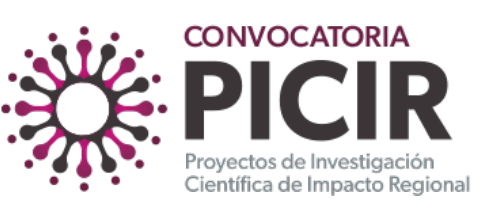
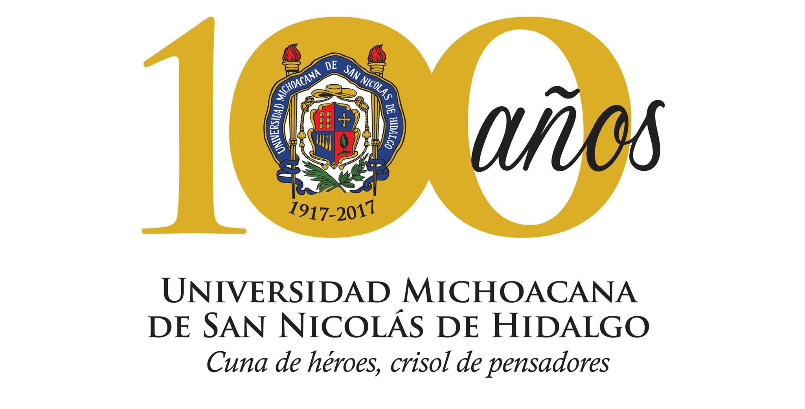
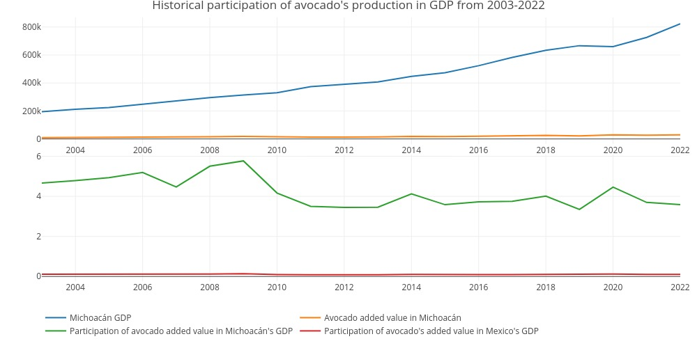
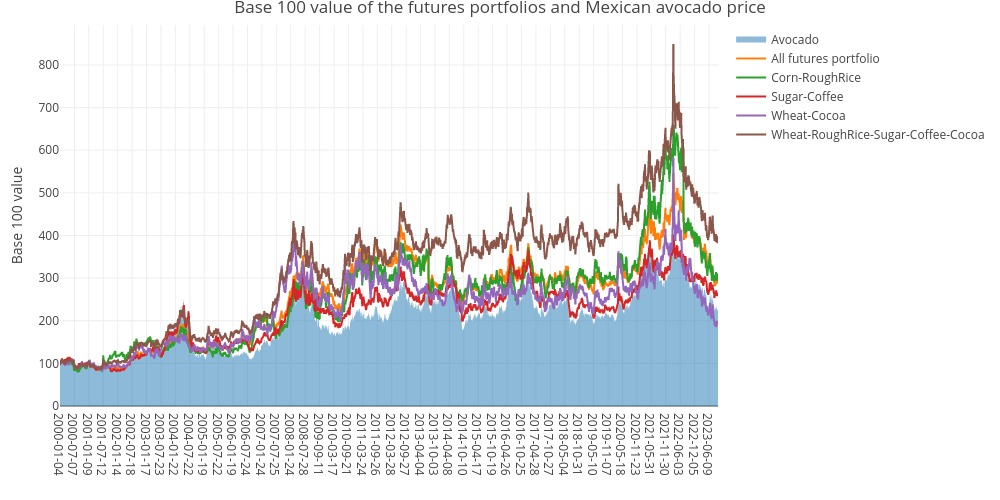

```{r setup, include=FALSE}
knitr::opts_chunk$set(echo = TRUE)
options(tinytex.verbose = TRUE)
library(flextable)
library(openxlsx)
library(plotly)
library(tibble)
library(dplyr)
library(bookdown)
library(tidyr)
library(plan)
library(forcats)
```

\begin{center}
\textbf{19 páginas efectivas de lectura en el documento sin incluir la presente portada. 18 de estas sin incluir la tabla de contenido}
\end{center}

```{r logo1, echo=FALSE, out.width="20%", fig.align = 'center'}

```

```{r logo3, echo=FALSE, out.width="20%", fig.align = 'center'}

```

\newpage 

\setcounter{tocdepth}{6}
\tableofcontents

\newpage 

# Datos generales del proyecto

**Título del proyecto:** Algoritmo para la cobertura del precio nacional del aguacate Hass producido
  en el Estado de Michoacán por medio coberturas agrícolas de las Bolsas de mercancías de Chicago y Nueva York provistas por SEGALMEX

**Folio ICTI:** ICTI-PICIR23-086

**Aprobación ICTI:** [Liga de la aprobación](https://icti.michoacan.gob.mx/picir-2023/)

**Área de conocimiento:** Área IV de Ciencias Sociales

**Modalidad:** Propuestas de proyectos de investigación científica con impacto regional (demanda libre)

## Presentación del proyecto, saludo y agradecimientos

Estimada Dra. Alejandra Ochoa Zarzosa,

Por medio del presente documento, reciba usted un cordial saludo. En primer término deseo agradecerle a Usted y al Instituto de Ciencia, Tecnología e Innovación del Estado de Michoacán (ICTI) por la oportunidad de presentar el presente proyecto de investigación. El mismo tiene como objetivo principal el desarrollo de un algoritmo que permita cubrir el precio nacional del aguacate Hass producido en el Estado de Michoacán por medio de coberturas sintéticas de los principales futuros agrícolas de las bolsas de mercancías de Chicago y Nueva York.

El apoyo financiero y académico que recibí con este financiamiento me permitió ampliar las capacidades e infraestructura de mi proyecto de investigación, enfocado en el desarrollo de algoritmos de cobertura de precios de productos agrícolas para lograr una soberanía alimentaria en México.

En el presente documento de formato libre, me permito detallarle la propuesta, problemas de investigación, hipótesis y objetivos planteados el desarrollo del presente proyecto. En el desarrollo de dicha relatoría me permitiré detallarle los objetivos, metas y entregables logrados.

Iniciaré con el breve resumen de mi proyecto para contextualizarle en mi informe.

## Resumen ejecutivo

En el presente proyecto de investigación se propone el desarrollo de una cobertura sintética para cubrir el precio de compra (venta) del precio nacional del aguacate Hass producido en el Estado de Michoacán. Para desarrollar dicha cobertura sintética se propone replicar el esquema de precios de garantía de SEGALMEX en las que este organismo del Gobierno Federal adquiere coberturas del maíz, trigo y arroz en las bolsas de derivados de Chicago y Nueva York. Esto a fin de ofrecer una cobertura (precios de garantía) de dichas mercancías a los productores mexicanos. Partiendo de esta necesidad práctica (cobertura dle precio del aguacate), se propone en este proyecto de investigación el desarrollo y prueba de un algoritmo que permita diseñar y seleccionar un portafolio óptimo de opciones de los principales futuros agrícolas de las bolsas de derivados de Chicago y Nueva York. 
**El objetivo fundamental del presente proyecto es demostrar la viabilidad material y factibilidad de las coberturas sintéticas que podría diseñar SEGALMEX para ofrecer un precio de garantía del precio nacional del aguacate Hass producido en Michoacán**.
Como parte de los retos científicos a resolver en este proyecto, se tiene que demostrar que la cobertura sintética es una replica lo suficientemente aproximada del precio del aguacate Hass. Sobre todo, se debe demostrar que la productividad de la industria del de aguacate Hass producido en Michoacán se incrementa si adquiere (con SEGALMEX o algún organismo afín) la cobertura sintética del precio de venta (compra) del aguacate.
El presente proyecto se espera impacte en el desarrollo económico del Estado de Michoacán. En concreto, en el índice de ingreso y la generación de productividad en la Entidad. Esto al mejorar el perfil de ingresos de productores y comercializadores de aguacate, así como una adecuada formación de precios y de mercado. De manera complementaria, se busca contribuir a las metas y **objetivos de seguridad y soberanía alimentaria2** establecidos en el **Plan Nacional de Desarollo 2018-2024** de la República Mexicana, así como con los objetivos de prosperidad económica de **Promover el crecimiento con bienestar y progreso con justicia** y **Fortalecer la gestión de riesgos financieros** y del **PLADIEM** del estado de Michoacán de Ocampo.
Con los resultados de este proyecto se espera que se fortalezcan la soberanía y seguridad alimentarias. Esto al tener mejores esquemas de cobertura del precio del aguacate producido en la Entidad y al lograr que los productores y comercializadores generen mayores ingresos, lo cual redunda en mayor empleo y bienestar en la industria del aguacate.

## Beneficiarios del proyecto de investigación

Los beneficiarios de este proyecto de investigación serán los productores y comercializadores de aguacate del estado de Michoacán quienes, potencialmente, podrían contar con mecanismos de coberturas o precios de garantía sobre el aguacate que producen. Esto con la finalidad de reducir volatilidad en sus ingresos.

De manera complementaria, el Gobierno del Estado de Michoacán se podría ver beneficiado en materia de ingresos por dos canales:

1. A mayores beneficios de los productores y comercializadores de aguacate en Michoacán, mayor será la base tributaria que el Gobierno Estatal y Federal pueden tener. Esto impactará en una **adecuada adminsitración de riesgos financieros y reducción de la deuda de Michoacán** (objetivo expresado en el PLADIEM).
2. Como resultado del deseo de participar en este programa de coberturas, el Gobierno Federal y el Gobierno Estatal podrán tener mayor evidencia documental de las ventas de aguacate que productores y empacadores podrán tener, al ser ingresos declarados aquellos que se están cubriendo con estas coberturas sintéticas.

De una manera indirecta, **la población vulnerable en condiciones de pobreza y aquella población vulnerable por incidencias del crimen organizado pueden beneficiarse ya que una mayor producción de aguacate, así como una mayor estabilidad en el ingreso, permitirá impactar positivamente en el pilar de ingresos del índice de desarrollo humano o IDH [@PNUD1991] y, conforme lo ha demostrado Yoo [-@Yoo2022], a mayor producción (y mayor estabilidad en los ingresos) de aguacate, menor incidencia de homicidios y violencia (-0.65 \% menos homicidios por cada 100 toneladas de aguacate producidas).**

La producción del aguacate representa alrededor del 3.58% del PIB estatal y el 0.5% del PIB nacional. Por lo que, al tener una mayor estabilidad en los ingresos de los productores y comercializadores de aguacate, se espera que la economía de Michoacán se vea beneficiada. La siguiente figura proviene del artículo de investigación (por ser aceptado para publicación) que se desarrolló para el presente proyecto de investigación y muestra la relación entre la producción de aguacate y el PIB estatal y nacional.

```{r figura1, echo=FALSE, out.width="90%", fig.align = 'center'}

```

## Problema general de investigación y su cumplimiento

El problema general de investigación que se planteó en el presente proyecto es:

**¿Es posible diseñar y adquirir un portafolio de coberturas (opciones) de las bolsa de mercancías de Chicago (CBOT) y de Nueva York (NYMEX) para cubrir el precio de compra o venta del aguacate Hass producido en el Estado de Michoacán?**

Conforme a los resultados, publicados en un **artículo científico** que está por ser aceptado en la [**revista Agriculture**](https://www.mdpi.com/journal/agriculture) que es factor de impacto 3.3. y Q1 del JCR, se demostró que **sí es posible cubrir el precio de compra o venta del aguacate Hass producido en Michoacán con un portafolio de opciones de los futuros agrícolas de la bolsa de mercancías de Chicago y Nueva York**. En específico se demostró que un portafolio de futuros del café y el cacao es la mejor opción para lograr una réplica adecuada del precio del aguacate Hass Mexicano producido en el Estado de Michoacán.

La siguiente figura es un resultado presentado en dicho artículo que muestra la cobertura cercana del precio del aguacate Hass con un portafolio de opciones de los futuros del café y el cacao.

```{r figura2, echo=FALSE, out.width="90%", fig.align = 'center'}

```


## Problemas particulares de investigación{#problemasParticulares}

El resolver este problema conlleva los siguientes problemas particulares:

1. **¿Tiene el comportamiento del precio de los futuros agrícolas maíz, trigo, arroz, soya, café, azúcar, jugo de naranja, cocoa) una relación estadística con el precio nacional del aguacate producido en Michoacán?**

**Resolución del problema con el proyecto:** Al demostrar que se puede replicar el precio del aguacate con un portafolio de futuros de café y cacao, se demuestra la relación estadística que dichos futuros tienen con el precio del aguacate. Esto se logra con una relación de cointegración entre los precios del aguacate y los futuros del café y el cacao. Dicha relación de cointegración se publicó en el artículo de investigación previamente citado.

2. **¿Si se adquiere un portfolio de opciones de compra (venta) del arroz, avena, azúcar, café, cacao, maíz trigo o grano de soya se puede cubrir exitosamente el precio de compra (venta) de un productor (comercializador) de aguacate producido en Michoacán?**

**Resolución del problema con el proyecto:** Al demostrar que se puede replicar el precio del aguacate con un portafolio de futuros de café y cacao, se demuestra que dicho portafolio se puede utilizar como cobertura del precio del aguacate. Esto sin que SEGALMEX u otra institución financiera deban desembolsar recursos propios o de las y los contribuyentes para cubrir el precio del aguacate.

3. **¿Tiene un impacto el sentimiento negativo medido en noticias o redes sociales en el precio del aguacate producido en Michoacán?**

**Resolución del problema con el proyecto:** Con las pruebas realizadas se hizo una demostración de que incluir el sentimiento del mercado influye en el precio del aguacate. Sin embargo, por los tiempos de revisión de un segundo artículo de investigación científica, no se tiene un entregable que presente la evidencia de esta influencia. Dicho esto, se seguirá con el proceso editorial de dicho artículo para tener una publicación en la revista Quality & Quantity en la que se revisó.

4. **¿Tiene un impacto el sentimiento negativo medido en noticias o redes sociales en el precio de los futuros del arroz, avena, azúcar, café, cacao, maíz trigo o grano de soya?**

**Resolución del problema con el proyecto:** La respuesta de este problema particular se realiza con la del problema número 3 al estar íntimamente relacionado con el presente.

5. **Si se incorpora el sentimiento negativo de noticias o redes sociales en el proceso de selección óptima del portafolio de coberturas para el precio del aguacate ¿Se obtendrán mejores resultados que el portafolio que no incorpora este sentimiento?**

**Resolución del problema con el proyecto:** La respuesta de este problema particular se realiza con la del problema número 3 al estar íntimamente relacionado con el presente.

En congruencia a la resolución de los problemas general y particular previamente detallados y resueltos, se observa que, en paralelo se lograron los objetivos generales y particular del proyecto.

## Objetivo general del proyecto de investigación{#objetivoGeneral}
En el presente apartado se expondrán los objetivos de investigación. La exposición se hará en la misma línea que el apartado anterior para exponer los objetivos como una consecuencia necesaria de las hipótesis a demostrar. De manera análoga, se presentan estos objetivos para poder materializarlos como metas cuantificables y verificables de los resultados logrados con el presente trabajo de investigación.

El objetivo general del presente trabajo de investigación, en consistencia a la hipótesis general planteada, es:

**Demostrar que se puede cubrir el precio nacional de compra (venta) del aguacate producido en el Estado de Michoacán por medio de una cobertura sintética formada con un portafolio de opciones del arroz, avena, azúcar, café, cacao, maíz trigo o grano de soya cotizadas en las bolsas de derivados de Chicago (CBOT) y Nueva York (NYMEX).**

El mismo se logra gracias a los resultados cuya publicación esté en proceso de materializarse en la revista Agriculture previamente citado.

# Metas del proyecto de investigación{#Metas}

En base a lo anterior, se detallan las metas planteadas en la [propuesta del proyecto de investigación](https://www.oscardelatorretorres.com/icti2023). En la misma exposición se manifiesta su logro correspondiente:

- Meta 1: Demostrar que el empleo del algoritmo para diseñar la cobertura sintética (seleccionar el portafolio óptimo de opciones de futuros agrícolas) permite tener una rentabilidad mayor que el omitir su uso y dejar que los ingresos del productor o comercializador de aguacate dependan de las fluctuaciones del mercado nacional. 
**Respuesta al logro de esta meta:** Con los resultados logrados, se aprecia que emplear

- Meta 2: Desarrollar una base de datos actualizable de manera diaria que compile la información historica de los ocho futuros agrícolas que se emplearán en la cobertura sintética y que ayudarán a cubrir el precio nacional del aguacate producido en el Estado de Michoacán.


- Meta 3: Desarrollar una base de datos actualizable que, de las bases de datos del Sistema Nacional de Información de Mercados [@SNIIM2023] de la Secretaría de Economía, extraiga los precios diarios del aguacate Hass originario del Estado de Michoacán, registrado en las principales centrales de abasto del país y calcule el precio promedio diario.

De manera análoga a la meta anterior, la presente meta permitirá la demostración de las hipótesis general y particulares 2 y 5 y coadyuvará al logro del objetivo general y particulares 2 y 5 del presente proyecto de investigación.

Con el precio promedio diario del aguacate producido en Michoacán se tendrá, con esta base de datos y la de la meta anterior, una infraestructura informática para poder lograr los objetivos de este proyecto y dejar la infraestructura necesaria para el desarrollo de proyectos análogos y extensiones del presente.

- Meta 4: Desarrollar códigos de simulación que se ejecuten de manera mensual para determinar la cobertura sintética idónea, empleando los ocho futuros agrícolas de interés y el precio del aguacate promedio calculados con las metas 2 y 3 previas. 

- Meta 5: Desarrollar aplicaciones en línea que permitan publicar los resultados actualizados en el sitio web personal del Dr. Oscar De la Torre Torres. Esto para su acceso gratuito por parte de la comunidad científica y profesional interesada en los temas. 


- Meta 6: Publicar los resultados de las simulaciones realizadas ante la comunidad científica afín a los agronegocios y a la Administración financiera. Esto implica publicación en artículos de revistas científicas, así como participaciones en ponencias de congresos de investigación (incluyendo el congreso regional de investigación del ICTI en 2024).


# Entregables comprometidos{#Entregables}

Como resultado de los objetivos planteados en el presente proyecto de investigación, así como de las metas que de los mismos surgen, se presentan los siguientes entregables:

1. Publicación de al menos un artículo en una revista científica indizada en Scopus o la Web of Science. El compromiso, dados los tiempos de financiamiento del proyecto, es tener en proceso de revisión o, preferentemente aceptado, el artículo. Para lograr esto, es que se planteará el publicar el artículo en alguna revista académica indizada a Scopus o la Web of Science que opere en el esquema de *open access*. Esto permitirá que los tiempos de revisión y editoriales sean más cortos. Ante esto, como se verá en el apartado del [desglose financiero](#Desglose), se contempla el pago de una publicación de un artículo.
2. La publicación y actualización periódica de los resultados de las simulaciones en una aplicación en línea en el sitio web del Dr. Oscar De la Torre Torres. Esto requerirá, como se verá en el [desglose financiero](#Desglose), del financiamiento de algunas instancias de servidores en nube, así como la contratación de servicios de bases de datos financieras y de APIS de noticias y redes sociales que permitan extraer la información financiera y de noticias.
3. El desarrollo y publicación de una función en R y una en Python que permita acceder a los precios históricos de las principales frutas y hortalizas monitoreadas por el SNIIM. Actualmente el SNIIM solo funciona con una interfaz visual en su sitio web. Con este entregable se pretende que exista una función que permita a más investigadoras e investigadores acceder fácilmente a las bases de datos del SNIIM con esta función. El objetivo es publicarla como una función de fuente abierta y acceso gratuito. La misma se publicará en los repositorios de GitHub y de PyPI.
4. El apoyo al desarrollo de 2 tesis de doctorado. Actualmente se tienen en curso 2 tesis de doctorado que buscan relacionar el sentimiento negativo y positivo en las noticias y redes sociales con los precios del maíz y del café. Esto para desarrollar algoritmos de coberturas de estas mercancías con opciones de las bolsas de Chicago y Nueva York. Es decir, desarrollar algoritmos que permitan a SEGALMEX y a los productores o comercializadores de aguacate determinar los momentos de cobertura necesarios. Por los tiempos de duración del proyecto de investigación propuesto, no se logrará la titulación de alguna de estas 2 tesis doctorales, debido a que los 2 sustentantes les falta 1.5 y 3.5 años para terminar su tesis y plan de estudios en el [Doctorado en Administración de la Facultad de Contadudía y Ciencias Administrativas de la UMSNH](https://www.fcca.umich.mx/doctorado/). A pesar de esto, el presente proyecto apoyará a los requerimientos de infraestructura informática para el logro de resultados en estas dos tesis de investigación:

  - **Factores de índices de sentimiento de mercado que inciden en la estimación de precios de referencia del maíz blanco en México y su cobertura con opciones de la Bolsa de derivados de Chicago a través de un algoritmo de toma de decisiones con precios de garantía de SEGALMEX**. Sustentante: M.C. Rodolfo Adrían López Torres (Doctorado en Administración FCCA-UMSNH). Generación 2021-2025.
  - **Factores de índices de sentimiento de mercado que inciden en la estimación de precios del precio nacional del Café y su cobertura con opciones de la Bolsa de derivados de Chicago. Una propuesta de algoritmo de coberturas para SEGALMEX**. Sustentante: M.A. Francisco Xavier Martínez Medina (Doctorado en Administración FCCA-UMSNH). Generación 2023-2027.

5. Ponencias en al menos 2 congresos de investigación. Se plantea que se expongan los resultados logrados en al menos 2 congresos de investigación, siendo uno de ellos el 19º Congreso Estatal de Ciencia, Tecnología e Innovación organizado por el ICTI.

## Infraestructura informática lograda con el financiamiento del proyecto

1. Computadora Mac Pro con procesador Intel Xeon de 3.5 GHz y 6 núcleos, 16 GB de memoria RAM, tarjeta gráfica AMD FirePro de 3GB y 120GB de disco duro en estado sólido. Esta computadora es la que se utiliza para hacer la parte más larga y amplia de las simulaciones de este proyecto de investigación y otros que le han antecedido. Los resultados de las simulaciones realizadas con esta computadora se actualizan, de manera diaria, en la siguiente computadora.
2. Computadora iMac con procesador Intel Core de 1.5 GHz y 2 núcleos, 18 GB de memoria RAM, tarjeta gráfica Intel Graphics de 3de 1.5 GB y 120GB de disco duro en estado sólido. Esta computadora es la que actualizará, de manera diaria o mensual (Según sea el caso) los datos de las simulaciones del presente proyecto.
3. Lenguajes de programación R y Python executados tanto en Rstudio como en Jupiter Networks. Esto para programar y ejecutar los CRONES que, de manera automática, actualizan las simulaciones realizadas.
4. Una licencia de Shiny apps para la publicación de las aplicaciones interactivas en línea con los resultados de las simulaciones previas. Esta se paga actualmente con recursos propios del Dr. Oscar V. De la Torre Torres (la CIC de la UMSNH actualmente no le puede apoyar con este rubro al cambiar las reglas de operación federales, relativas a los recursos financieros de los proyectos de la CIC) y se pretende financiar las mismas con recursos del presente proyecto.
5. Una licencia de las bases de datos económicos, financieras y de futuros Refinitiv Eikon y Economatica que actualmente paga el Dr. Oscar V. De la Torre Torres con recursos propios (la CIC de la UMSNH actualmente no le puede apoyar con este rubro al cambiar las reglas de operación federales, relativas a los recursos financieros de los proyectos de la CIC). Se pretende financiar estas bases de datos con los recursos del presente proyecto de investigación.
