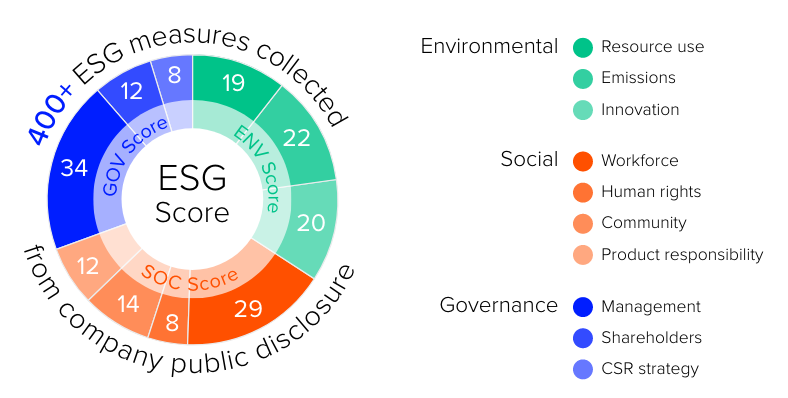

```{r setup, include=FALSE}
knitr::opts_chunk$set(echo = FALSE)
library(shiny)
library(openxlsx)
library(kableExtra)
library(DT)
library(tibble)
library(MASS)
library(gghighlight)
library(kableExtra)
library(shinyalert)
library(shinyWidgets)
library(stargazer)
library(ggpubr)
library(PearsonDS)
library(siebanxicor)
library(lubridate)
library(quantmod)
library(tseries)
library(plotly)
library(FinancialMath)
library(FinCal)
library(siebanxicor)
library(officer)
library(flextable)
library(GGally)
library(psych)
library(timeSeries)
library(fPortfolio)
```

# Abstract

The present paper answers the following question: What would the performance of a US dollar (USD) based investor be if she or he invested only in public companies with proper water management practices in Latin America (LATAM)? 

To answer it, the researcher used the water-to-revenues (WTR) ratio to measure water management quality. He simulated the performance of a portfolio invested mainly in companies with the best WTR (from January 6th, 2005, to Abril 20, 2022). 

With a comparison of the simulated portfolio's performance against a LATAM broad market portfolio, the results suggest that both portfolios have similar performance in the short term. 

In the long term, the tests found that the WTR has a low systematic (market) risk (beta of 0.26), and its performance is more stable (mean-variance efficient) than the broad market portfolio. The tests also control for currency, concluding that, in this scenario, the results hold. 

The conclusions of this paper could be of use to investors to engage in water management activism through investing in reducing the risk that water consumption and disposal represent to the world in years to come.

**Keywords**: Water investing; water management; portfolio management; ESG investing; water disposal risk; firm risk; Latin American stock markets

**JEL keywords**: G11; G12; Q53; Q56

# Introduction

```{r logo3, echo=FALSE, out.width="20%", fig.align = 'center'}
knitr::include_graphics("umsnh100a.jpg")
```

## The ESG investing background of water activist investing

- Water consumption disclosure is part of ESG metrics (in the **E**nvironmental pillar) @Markowitz1952.
- Water consumption & disposal risk [@WEF2022] can be attended through water activist investing.
- Environmental Social and Governance investing (**ESG investing**) and water management disclosure are related issues for companies and investors. The former has seen ESG practices (including water management ones) as a way of engaging in a better relationship between reputation and profits [@dawkins_coming_2010; @fombrun_whats_1990; @hasseldine_quantity_2005; @Lee2016; @tetlock_all_2011]. Also, some firms engage in fundamental ESG practices to better impact their environment and stakeholders. This practice significantly improved their total or market risk profile and debt or equity rising costs [@delgado-garcia_impact_2013; @jo_does_2012; @kolbel_how_2017; @oikonomou_impact_2012; @orlitzky_corporate_2016; @salama_does_2011]. 

- ESG investing manages a portfolio with stock selected in a ESG screening process.
  - Positive screening: includes stocks of companies with ESG standards, given an ESG threeshold.
  - Negative screening: excludes stocks with low ESG standards (also given a threeshold).

## ESG investing as investment style

ESG investing has evolved from its origins in religious practices to a modern portfolio management or investment style of its own.

Berry and Junkus [-@Berry2013] and Chatzitheodorou et al. [-@chatzitheodorou_exploring_2019] suggested ESG investment refers to a type of investment style in which the investor prefers to invest in socially responsible companies in her or his managed portfolio. 

The companies of interest must fulfill ESG criteria that the investor considers appropriate for her or his long-term financial performance and sustainability level. 

## The Friedman vs. Freeman debate

The debate that an ESG company sacrifices its company performance (profitability) due to costs incurred with ESG practices. 

That is, sometimes a company is profitable if it has a negative social or environmental impact. To comply with sustainability rules, it must invest in more expensive production processes or sacrifice production to be ESG compliant. 

- Friedman [-@friedman_social_2007]: *"financial performance is the only sustainability task a company must comply with"*. 
- Freeman [-@Freeman1984; -@Freeman1994]: *"The benefits of ESG practices are in the long-term because the company improves its customer or employee relations, reduces legal, reputational, or social risks, and, as a result, increases its productivity"*.

## Water activist investing definition

Similar to ESG investing's historical origins in which investors made a sort of *"activism"* to push companies to a better behavior in Environmental, Social or Governance,
**water activist investing** could be defined as 

*"The series of actions in which investors push companies to be more responsible in their water management practices."*

For the optics of this research, water activis investing means **to perform a positive screening of stocks with good water consumption standards**.

## Water activist investing measurement

Water consumption items are part of the **E**nvironmental ESG pillar and is part of the ones of interest of several ESG grading companies such as **MSCI-Eiris**, **Robbeco-Bloomberg**, **Morningstar sustainalytics**, **S&P ESG scores**, or **Refinitiv ESG scores** 

The score methodology of interest is the one of Refinitiv [-@refinitiv_environmental_2022]. It grades more than 400 items and organize them in 10 factors and three pillars:

```{r figura1, echo=FALSE, out.width="50%", fig.align = 'center', fig.cap="Refinitiv ESG score methodology. Source: Refinitiv (2019)"}


```

Among the 19 **resource use** items we found the **water consumption (in cubic meters) per revenues** item ($WTR_{i,t}$). Therefore, **water activist investing** will operate through $WTR_{i,t}$ positive screening. 

That is, the research simulated a theoretical agent that invested only in companies with high $WTR_{i,t}$ from **January 2nd of 1998 to April 29th of 2022).

$$
WTR_{i,t}=\frac{M^3\text{ of water consumed}_{i,t}}{\text{Revenues}_{i,t}}
$$

# Working hypothesis definition

The portfolio selection process screens stocks of companies with high water consumption standards (high $WTR_{i,t}$). This leads to a theoretically mean-variance inefficient portfolio (portfolio $P$), compared with a broader market one ($M$).

If mean-variance efficiency is proxied with the Sharpe [-@Sharpe1966] ratio:

$$S_{p,t}=\frac{E_P-rf}{\sigma_P} $$
Where:

- $E_P$: The expected return of the portfolio $P$.
- $\sigma_P$: The risk exposure (standard deviation) of $P$.
- $rf$: The risk-free asset return.

Classical Financial Economics Theory predicts

$M \prec P \iff S_{M,t}\leq S_{P,t}$

## Theoretical conception of the working hypothesis

This theoretical figure shows the Classical Financial Economics position (the one tested herein in which the Research has an opposite position).

```{r sim1, echo=FALSE, warning=FALSE, message=FALSE, error=FALSE}
rf=runif(1,min=0, max=0.1)
X=as.data.frame(matrix(0,500,60))
  for (a in 1:60) {
    X[,a]=as.numeric(matrix(rf+rnorm(500, mean=rf+rnorm(1,0),sd=sqrt(rchisq(1,df=499)))))
  }
eval(parse(text=paste0("nombres=",paste0("c(",paste0("'A",seq(from=1,to=60,by=1),collapse="',"),"')"))
      ))
colnames(X)=nombres

X2=X[,1:30]

X=as.timeSeries(X)
X2=as.timeSeries(X2)

# summary of X

sumario=data.frame(riesgo=colSds(X),
                   rendimiento=colMeans(X))
portfoliospec=portfolioSpec(portfolio= list(
        weights = NULL, targetReturn = NULL,
        targetRisk = NULL, riskFreeRate = rf, nFrontierPoints = 100,
        status = NA))

myestimator=function(Returns,portfoliospec){
  list(mu=mean.returns,sigma=Covar)
}

portfolio=portfolioFrontier(data=X,spec=portfoliospec)
portfolio2=portfolioFrontier(data=X2,spec=portfoliospec)

# Minvariance protfolio
mvportfolio=minvariancePortfolio(data=X,spec=portfoliospec)

# Tangency portfolio:
tgportfolio=tangencyPortfolio(data=X,spec=portfoliospec)
tgportfolio2=tangencyPortfolio(data=X2,spec=portfoliospec)


# tabla portafolios eficientes:
portsEf=data.frame(
  portafolio=1:99,
  riesgo=portfolio@portfolio@portfolio$targetRisk[,2],
  rendimiento=portfolio@portfolio@portfolio$targetReturn[,1]
)

portsEf2=data.frame(
  portafolio=1:99,
  riesgo=portfolio2@portfolio@portfolio$targetRisk[,2],
  rendimiento=portfolio2@portfolio@portfolio$targetReturn[,1]
)

figura1=plot_ly()
figura1=add_trace(figura1,x=~riesgo,y=~rendimiento,data=portsEf2,type="scatter",mode="lines", textposition = 'top right',name="Water portfolio")
figura1=add_trace(figura1,x=~riesgo,y=~rendimiento,data=sumario,type="scatter",mode="markers", textposition = 'top right',name="Individual assets")
figura1=add_trace(figura1,x=~riesgo,y=~rendimiento,data=portsEf,type="scatter",mode="lines", textposition = 'top right',name="Market portfolio")%>%layout(
         yaxis=list(title="Rendimiento esperado (%)"),
         xaxis=list(title="Riesgo (%)"),
         title="Theoretical market and water portfolios (simulation)",
         showlegend = TRUE)

figura1
```


## Working hypothesis

Given the portfolio $P$ invested mainly in companies with high $WTR_{i,t}$ values it is expected that the simulated portfolio $P$, invested in stocks of the four main Latin American stock markets (Argentina, Brazil, Chile and Mexico), according to the WFE [-@world_federation_of_exchanges_fy_2022], will be more or at least equally mean-variance efficient than these four stock markets portfolio ($M$):

$H_0:$ *"The simulated water activist portfolio is  more or, at least, equally mean-variance efficient than the market one."*

## Practical implications of the hypothesis test

1. If the results prove as true, then an individual or institutional investor could invest in **water responsible** companies.
2. Companies could feel compelled to enhance their water consumption profile, given the higher demand of  water responsible stocks (**the shunned-stock hypothesis** of Derwall [-@Derwall2011; -@Derwall2019]), their cost of capital could be lower.
3. Water activism could reduce the impact of water disposal.

# Previous works that motivate this research

There are only works that tested the performance of ESG portfolios v.s. a non-ESG (even sinful or *"bad practices"* portfolio). Some of the most recent are focused in:

- ESG-ROE relationship:
  - U.S. stocks [@Blasi2018; @brogi_environmental_2019]: Positive relationship as conclusion.
  - Australia, France and Korea [@Crifo2016; @Galbreath2013; @Lee2016; @Sethi2017]: ESG harm profits.
  - Mexico [@alonso-almeida_corporate_2009; @garcia-santos_is_2019; @godinez-reyes_efficiency_2021]: ESG practices hav eno financial cost and a positive relationship with ROE.
- U.S. companies' ESG score vs. market risk [@botha_analysis_2015; @jo_does_2012; @salama_does_2011]: The higher the ESG practices the lower the market risk in a given company.
- Pension funds [@Amalric2006; @DelaTorre-Torres2018; @Hongbo2006; @Sethi2005]: ESG screened stock portfolios enhance the performance of pension funds.


# Previous works that motivate this research 

Only the work of Zeng et al. [-@zeng_water_2020] relates closely with the present research. These authors found no negative ESG-market risk in chinese stocks.

No previous works tested the performance of a water screened portfolio vs. a market portfolio. This is a gap the research intends to fill for the Latin American case in two perspectives:

- A USD based investor.
- A local currency based portfolio to control the impact of FX rates movements.

# Empirical tests: data gathering and processing

## Investment universe (the set of stock used)

To perform the simulations the research used historical **daily** data (price levels) of the stock members of the **Refinitiv Latin America price return index** that is a set of the Refinitiv stock indexes mentioned in Table 1. The full investment universe (set of stock used) is [appendix A](#appendixA).

The stocks in this set, are the investment universe $\mathbf{\Phi}$.

```{r table1, echo=FALSE}
indices=read.xlsx("table1.xlsx")
tabla1=flextable(indices)%>%autofit()
tabla1=set_header_labels(tabla1,
                  RIC="Refinitiv RIC",
                  Index="Refinitiv index used",
                  Index.type="Index type",
                  Country="Region or country of coverage")
tabla1=set_caption(tabla1, "Table 1. The investment universe determined by the Refinitiv LATAM price index.")
tabla1
```

## Data gathering and processing for the market portfolio $M$

With the investment universe of Table 1 and [Appendix A](#appendixA) the research used the historical price of each stock each day $P_t$ to estimate the continous time return $r_t$:

$$r_{i,t}=\Delta\%P_t=ln(P_{i,t})-ln(P_{i,t-1})$$
Also, the historical free-float market capitalization or $MC_{i,t}$ (in USD and local currency) value of each stock was downloaded and used to estimate the investment level $\omega_{i,M.t}$ of each stock at $t$, given the cardinality of the investement universe $N=\#(\Phi)$:

$$
\omega_{i,M,t}= \frac{MC_{i,t}}{\sum_{i=1}^N MC_{i,t}}
$$

With the investment level $\omega_{i.M,t}$ a weighted average market portfolio return was estimated:

$$r_{M,t}=\sum_{i=1}^N \omega_{i,M,t}\cdot r_{i,t}$$

$r_{M,t}$ was used to estimate a base 100 value (at January 1998), and as a benchmark to compare the water portfolio's $P$ performance.

## Data gathering and processing for the water portfolio $P$

To simulate the water screened portfolio (**water activist portfolio**) the research used the investment levels in each stock in the market portfolio $\omega_{i,M,t}$ and estimated an investment level cap value $ic_{i,t}$. This cap or maximum investment level is estimated with the water-to-revenues $WTR_{i,t}$ value in each stock as follows:

\begin{equation}
ic_{i,t}= \begin{cases}
1-\frac{WTR_{i,t}}{\sum_{i=1}^N WTR_{i,t}} & \text{ if }WTR_{i,t}\neq0\\ 
 0 & \text{ if }WTR_{i,t}=0
\end{cases}
\end{equation}

The rationale of the cap investment level is **"The lower the water consumption level related to revenues, the higher the investment level in the water portfolio $P$"**.

This led to the investment levels in the water portfolio $P$:

\begin{equation}
\omega_{i,P,t}=\omega_{i,M,t}\cdot ic_{i,t}
\end{equation}

Similar to the market portfolio $M$, the historical return of the water portfolio was estimated as a weighted return average of each stock in the portfolio:

$$r_{P,t}=\sum_{i=1}^N \omega_{i,P,t}\cdot r_{i,t}$$

## Historical portfolio parameters in the simulations

Given an $N\times N$ variance covariance matrix $\mathbf{C}=[\sigma{i,j}]$ of the stocks in the portfolio, and a $N\times 1$ expected return vector of each asset $e=[\bar{r}_{i,t}]$, along with the $N\times 1$ vector, either market portfolio investment levels $\mathbf{w}_M=[\omega_{i,M,t}]$, or water portfolio $\mathbf{w}_P=[\omega_{i,P,t}]$, the 

# Appendix A{#appendixA}

This table shows the investment universe $\mathbf{\Phi}$ for the simulations.

```{r tablaA1}
tablaA1t=read.xlsx("appendixA.xlsx")
tablaA1t$firstDate=as.Date(tablaA1t$firstDate,origin="1899-12-30")
tablaA1t=datatable(tablaA1t, filter = 'bottom', options = list(pageLength = 5),
                   caption="Table A1. The investment universe of the simulations in full.")

tablaA1t
```


# References